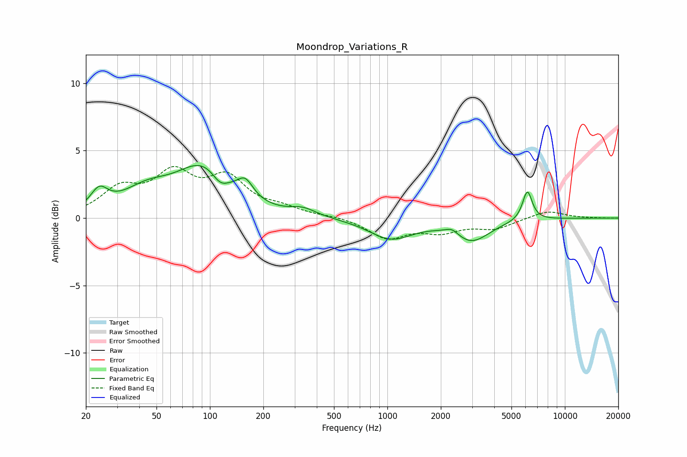

# Moondrop_Variations_R
See [usage instructions](https://github.com/jaakkopasanen/AutoEq#usage) for more options and info.

### Parametric EQs
Apply preamp of -4.0 dB when using parametric equalizer.

|   # | Type    |   Fc (Hz) |    Q |   Gain (dB) |
|-----|---------|-----------|------|-------------|
|   1 | Peaking |        24 | 2.95 |         1.5 |
|   2 | Peaking |        44 | 1.01 |         1.6 |
|   3 | Peaking |        92 | 0.93 |         3.6 |
|   4 | Peaking |       114 | 3.12 |        -0.9 |
|   5 | Peaking |       158 | 3.18 |         1.3 |
|   6 | Peaking |       335 | 1.96 |         0.5 |
|   7 | Peaking |      1047 | 1.14 |        -1.5 |
|   8 | Peaking |      2313 | 3.72 |         0.5 |
|   9 | Peaking |      2971 | 1.37 |        -1.6 |
|  10 | Peaking |      6146 | 5.07 |         2.2 |

### Fixed Band EQs
When using fixed band (also called graphic) equalizer, apply preamp of **-3.9 dB** (if available) and set gains manually with these parameters.

|   # | Type    |   Fc (Hz) |    Q |   Gain (dB) |
|-----|---------|-----------|------|-------------|
|   1 | Peaking |        31 | 1.41 |         2   |
|   2 | Peaking |        62 | 1.41 |         3   |
|   3 | Peaking |       125 | 1.41 |         2.7 |
|   4 | Peaking |       250 | 1.41 |         0.6 |
|   5 | Peaking |       500 | 1.41 |         0.1 |
|   6 | Peaking |      1000 | 1.41 |        -1.5 |
|   7 | Peaking |      2000 | 1.41 |        -0.9 |
|   8 | Peaking |      4000 | 1.41 |        -0.7 |
|   9 | Peaking |      8000 | 1.41 |         0.6 |
|  10 | Peaking |     16000 | 1.41 |        -0   |

### Graphs

