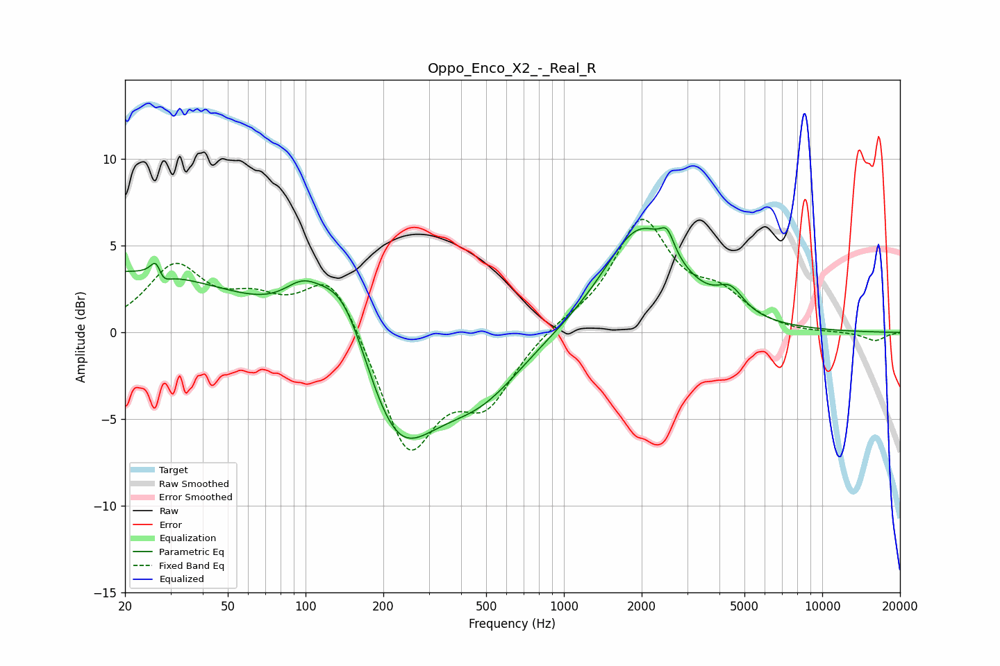

# Oppo_Enco_X2_-_Real_R
See [usage instructions](https://github.com/jaakkopasanen/AutoEq#usage) for more options and info.

### Parametric EQs
Apply preamp of -6.1 dB when using parametric equalizer.

|   # | Type    |   Fc (Hz) |    Q |   Gain (dB) |
|-----|---------|-----------|------|-------------|
|   1 | Peaking |        20 | 0.33 |         3.5 |
|   2 | Peaking |        27 | 5.98 |         3.2 |
|   3 | Peaking |        27 | 5.48 |        -2.8 |
|   4 | Peaking |        97 | 1.96 |         1.4 |
|   5 | Peaking |       140 | 1.28 |         4.7 |
|   6 | Peaking |       223 | 0.93 |        -6.9 |
|   7 | Peaking |       476 | 0.83 |        -3   |
|   8 | Peaking |      1972 | 0.98 |         6.1 |
|   9 | Peaking |      2512 | 5.41 |         1.2 |
|  10 | Peaking |      4415 | 2.76 |         1.3 |

### Fixed Band EQs
When using fixed band (also called graphic) equalizer, apply preamp of **-6.6 dB** (if available) and set gains manually with these parameters.

|   # | Type    |   Fc (Hz) |    Q |   Gain (dB) |
|-----|---------|-----------|------|-------------|
|   1 | Peaking |        31 | 1.41 |         3.7 |
|   2 | Peaking |        62 | 1.41 |         1.5 |
|   3 | Peaking |       125 | 1.41 |         3.6 |
|   4 | Peaking |       250 | 1.41 |        -6.9 |
|   5 | Peaking |       500 | 1.41 |        -3.7 |
|   6 | Peaking |      1000 | 1.41 |         0.5 |
|   7 | Peaking |      2000 | 1.41 |         6.3 |
|   8 | Peaking |      4000 | 1.41 |         1.8 |
|   9 | Peaking |      8000 | 1.41 |        -0.1 |
|  10 | Peaking |     16000 | 1.41 |        -0.5 |

### Graphs

