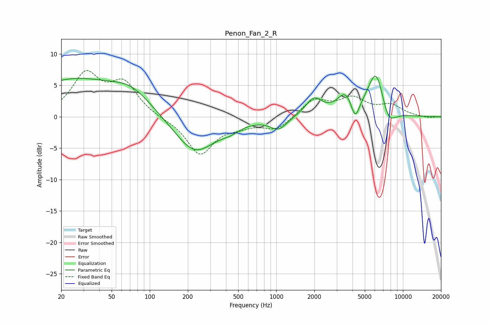

# Penon_Fan_2_R
See [usage instructions](https://github.com/jaakkopasanen/AutoEq#usage) for more options and info.

### Parametric EQs
Apply preamp of -6.6 dB when using parametric equalizer.

|   # | Type    |   Fc (Hz) |    Q |   Gain (dB) |
|-----|---------|-----------|------|-------------|
|   1 | Peaking |        24 | 0.39 |         5.7 |
|   2 | Peaking |        72 | 0.88 |         2.8 |
|   3 | Peaking |       227 | 0.87 |        -5.9 |
|   4 | Peaking |       434 | 2.03 |        -0.8 |
|   5 | Peaking |      1044 | 2.14 |        -1.9 |
|   6 | Peaking |      1980 | 2.15 |         2.8 |
|   7 | Peaking |      3527 | 2.22 |         3.3 |
|   8 | Peaking |      4195 | 4.16 |        -3.3 |
|   9 | Peaking |      6153 | 2.03 |         7.7 |
|  10 | Peaking |      7621 | 2.21 |        -3.4 |

### Fixed Band EQs
When using fixed band (also called graphic) equalizer, apply preamp of **-7.5 dB** (if available) and set gains manually with these parameters.

|   # | Type    |   Fc (Hz) |    Q |   Gain (dB) |
|-----|---------|-----------|------|-------------|
|   1 | Peaking |        31 | 1.41 |         6.5 |
|   2 | Peaking |        62 | 1.41 |         5   |
|   3 | Peaking |       125 | 1.41 |        -0.2 |
|   4 | Peaking |       250 | 1.41 |        -5.9 |
|   5 | Peaking |       500 | 1.41 |        -1   |
|   6 | Peaking |      1000 | 1.41 |        -2   |
|   7 | Peaking |      2000 | 1.41 |         2.7 |
|   8 | Peaking |      4000 | 1.41 |         2.7 |
|   9 | Peaking |      8000 | 1.41 |         1.7 |
|  10 | Peaking |     16000 | 1.41 |        -0.2 |

### Graphs

