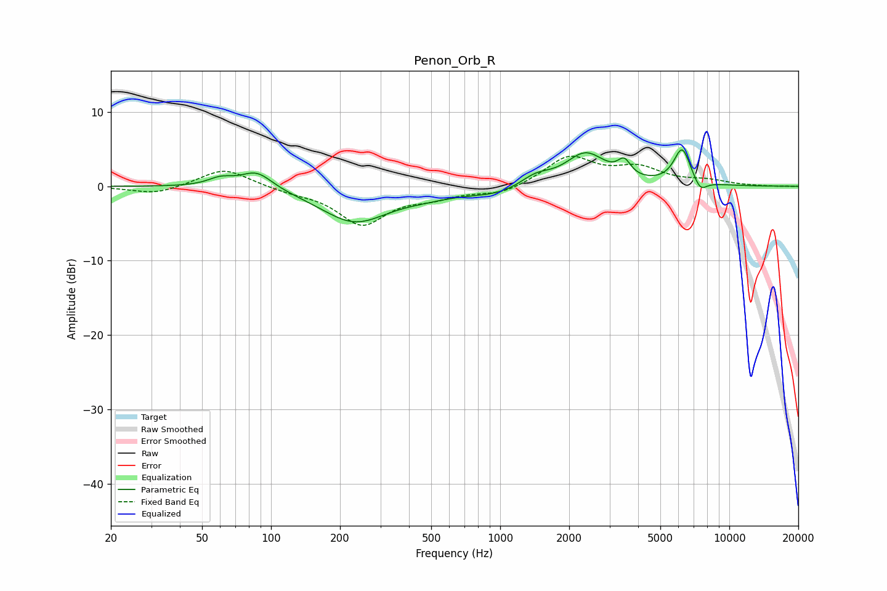

# Penon_Orb_R
See [usage instructions](https://github.com/jaakkopasanen/AutoEq#usage) for more options and info.

### Parametric EQs
Apply preamp of -5.0 dB when using parametric equalizer.

|   # | Type    |   Fc (Hz) |    Q |   Gain (dB) |
|-----|---------|-----------|------|-------------|
|   1 | Peaking |        60 | 2.56 |         1   |
|   2 | Peaking |        87 | 2.04 |         2.4 |
|   3 | Peaking |       232 | 0.95 |        -4.7 |
|   4 | Peaking |       470 | 1.24 |        -0.6 |
|   5 | Peaking |       987 | 0.99 |        -1.2 |
|   6 | Peaking |      1423 | 2.05 |         1.5 |
|   7 | Peaking |      2360 | 1.6  |         4.4 |
|   8 | Peaking |      3478 | 5.06 |         2   |
|   9 | Peaking |      6226 | 3.75 |         4.9 |
|  10 | Peaking |      7469 | 4.71 |        -1.6 |

### Fixed Band EQs
When using fixed band (also called graphic) equalizer, apply preamp of **-4.2 dB** (if available) and set gains manually with these parameters.

|   # | Type    |   Fc (Hz) |    Q |   Gain (dB) |
|-----|---------|-----------|------|-------------|
|   1 | Peaking |        31 | 1.41 |        -1.1 |
|   2 | Peaking |        62 | 1.41 |         2.5 |
|   3 | Peaking |       125 | 1.41 |        -0.6 |
|   4 | Peaking |       250 | 1.41 |        -5   |
|   5 | Peaking |       500 | 1.41 |        -1.2 |
|   6 | Peaking |      1000 | 1.41 |        -1.1 |
|   7 | Peaking |      2000 | 1.41 |         3.9 |
|   8 | Peaking |      4000 | 1.41 |         2.2 |
|   9 | Peaking |      8000 | 1.41 |         0.6 |
|  10 | Peaking |     16000 | 1.41 |        -0   |

### Graphs

