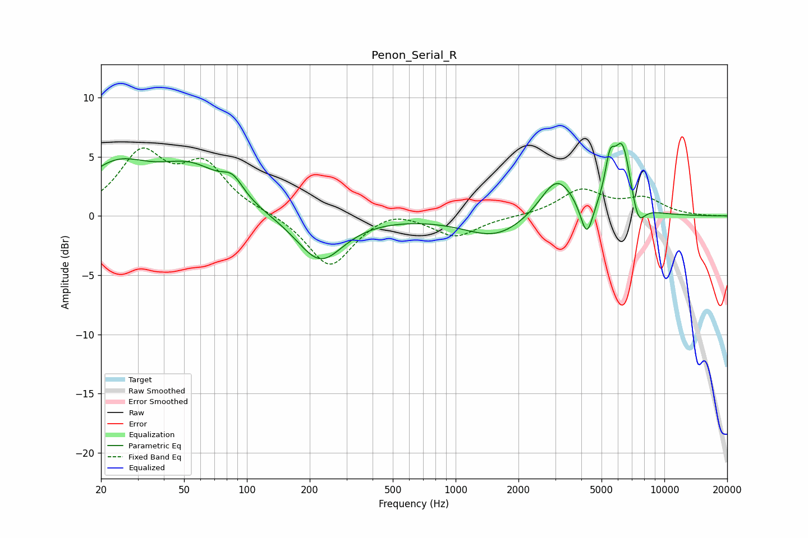

# Penon_Serial_R
See [usage instructions](https://github.com/jaakkopasanen/AutoEq#usage) for more options and info.

### Parametric EQs
Apply preamp of -6.2 dB when using parametric equalizer.

|   # | Type    |   Fc (Hz) |    Q |   Gain (dB) |
|-----|---------|-----------|------|-------------|
|   1 | Peaking |        24 | 0.86 |         3.8 |
|   2 | Peaking |        55 | 0.89 |         3.4 |
|   3 | Peaking |        85 | 2.8  |         1.5 |
|   4 | Peaking |       224 | 1.27 |        -3.9 |
|   5 | Peaking |      1565 | 0.95 |        -1.9 |
|   6 | Peaking |      3056 | 1.74 |         3.4 |
|   7 | Peaking |      4250 | 4.65 |        -3   |
|   8 | Peaking |      5486 | 5.85 |         3   |
|   9 | Peaking |      6299 | 3.24 |         5.8 |
|  10 | Peaking |      7482 | 4.18 |        -2.2 |

### Fixed Band EQs
When using fixed band (also called graphic) equalizer, apply preamp of **-5.8 dB** (if available) and set gains manually with these parameters.

|   # | Type    |   Fc (Hz) |    Q |   Gain (dB) |
|-----|---------|-----------|------|-------------|
|   1 | Peaking |        31 | 1.41 |         5   |
|   2 | Peaking |        62 | 1.41 |         4   |
|   3 | Peaking |       125 | 1.41 |         0.2 |
|   4 | Peaking |       250 | 1.41 |        -4.4 |
|   5 | Peaking |       500 | 1.41 |         0.8 |
|   6 | Peaking |      1000 | 1.41 |        -1.7 |
|   7 | Peaking |      2000 | 1.41 |        -0   |
|   8 | Peaking |      4000 | 1.41 |         2.1 |
|   9 | Peaking |      8000 | 1.41 |         1.4 |
|  10 | Peaking |     16000 | 1.41 |        -0   |

### Graphs

