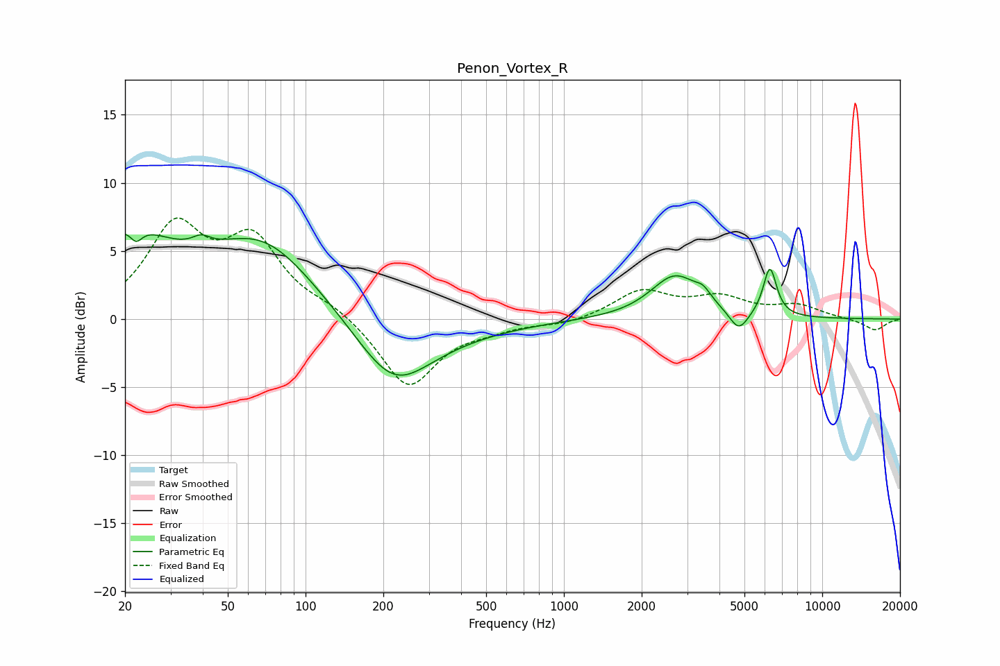

# Penon_Vortex_R
See [usage instructions](https://github.com/jaakkopasanen/AutoEq#usage) for more options and info.

### Parametric EQs
Apply preamp of -6.3 dB when using parametric equalizer.

|   # | Type    |   Fc (Hz) |    Q |   Gain (dB) |
|-----|---------|-----------|------|-------------|
|   1 | Peaking |        20 | 0.8  |         5.7 |
|   2 | Peaking |        22 | 5.94 |        -1   |
|   3 | Peaking |        39 | 4.25 |         0.7 |
|   4 | Peaking |        69 | 0.68 |         5.5 |
|   5 | Peaking |       218 | 1.01 |        -4.3 |
|   6 | Peaking |       277 | 0.52 |        -1.1 |
|   7 | Peaking |      2696 | 1.5  |         3.2 |
|   8 | Peaking |      3460 | 4.72 |         0.7 |
|   9 | Peaking |      4751 | 3.77 |        -1.6 |
|  10 | Peaking |      6271 | 5.33 |         3.6 |

### Fixed Band EQs
When using fixed band (also called graphic) equalizer, apply preamp of **-7.5 dB** (if available) and set gains manually with these parameters.

|   # | Type    |   Fc (Hz) |    Q |   Gain (dB) |
|-----|---------|-----------|------|-------------|
|   1 | Peaking |        31 | 1.41 |         6.4 |
|   2 | Peaking |        62 | 1.41 |         5.3 |
|   3 | Peaking |       125 | 1.41 |         0.8 |
|   4 | Peaking |       250 | 1.41 |        -5.1 |
|   5 | Peaking |       500 | 1.41 |        -0.5 |
|   6 | Peaking |      1000 | 1.41 |        -0.4 |
|   7 | Peaking |      2000 | 1.41 |         2   |
|   8 | Peaking |      4000 | 1.41 |         1.4 |
|   9 | Peaking |      8000 | 1.41 |         0.9 |
|  10 | Peaking |     16000 | 1.41 |        -0.9 |

### Graphs

