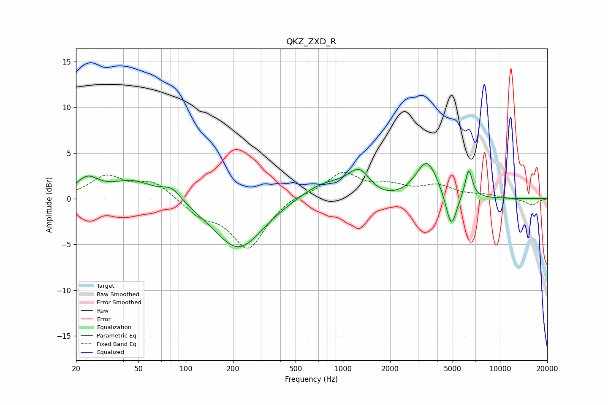

# QKZ_ZXD_R
See [usage instructions](https://github.com/jaakkopasanen/AutoEq#usage) for more options and info.

### Parametric EQs
Apply preamp of -3.9 dB when using parametric equalizer.

|   # | Type    |   Fc (Hz) |    Q |   Gain (dB) |
|-----|---------|-----------|------|-------------|
|   1 | Peaking |        24 | 1.99 |         1.9 |
|   2 | Peaking |        46 | 1.02 |         2   |
|   3 | Peaking |        81 | 2.27 |         1.3 |
|   4 | Peaking |       217 | 0.9  |        -5.6 |
|   5 | Peaking |       776 | 0.87 |         2.1 |
|   6 | Peaking |      1276 | 1.89 |         3.1 |
|   7 | Peaking |      1461 | 0.85 |        -1.1 |
|   8 | Peaking |      3427 | 2.03 |         4.2 |
|   9 | Peaking |      4899 | 4.08 |        -3.9 |
|  10 | Peaking |      6333 | 5.95 |         3.2 |

### Fixed Band EQs
When using fixed band (also called graphic) equalizer, apply preamp of **-3.0 dB** (if available) and set gains manually with these parameters.

|   # | Type    |   Fc (Hz) |    Q |   Gain (dB) |
|-----|---------|-----------|------|-------------|
|   1 | Peaking |        31 | 1.41 |         2.4 |
|   2 | Peaking |        62 | 1.41 |         1.8 |
|   3 | Peaking |       125 | 1.41 |        -1.6 |
|   4 | Peaking |       250 | 1.41 |        -5.4 |
|   5 | Peaking |       500 | 1.41 |         0.5 |
|   6 | Peaking |      1000 | 1.41 |         2.7 |
|   7 | Peaking |      2000 | 1.41 |         1.1 |
|   8 | Peaking |      4000 | 1.41 |         1.3 |
|   9 | Peaking |      8000 | 1.41 |         0.3 |
|  10 | Peaking |     16000 | 1.41 |        -0.7 |

### Graphs

