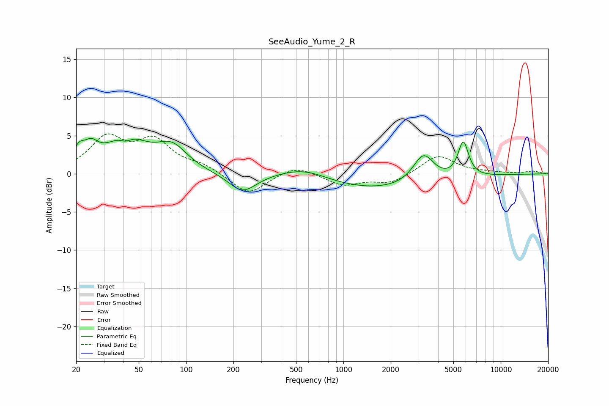

# SeeAudio_Yume_2_R
See [usage instructions](https://github.com/jaakkopasanen/AutoEq#usage) for more options and info.

### Parametric EQs
Apply preamp of -4.7 dB when using parametric equalizer.

|   # | Type    |   Fc (Hz) |    Q |   Gain (dB) |
|-----|---------|-----------|------|-------------|
|   1 | Peaking |        21 | 4.17 |         1.9 |
|   2 | Peaking |        25 | 3.11 |         2.1 |
|   3 | Peaking |        41 | 3.73 |        -0.9 |
|   4 | Peaking |        41 | 1.1  |         4.5 |
|   5 | Peaking |        81 | 1.47 |         3   |
|   6 | Peaking |       228 | 1.6  |        -2.5 |
|   7 | Peaking |       564 | 0.89 |         1.6 |
|   8 | Peaking |      1657 | 0.35 |        -2.2 |
|   9 | Peaking |      3228 | 2.11 |         3.9 |
|  10 | Peaking |      5781 | 4.12 |         4.6 |

### Fixed Band EQs
When using fixed band (also called graphic) equalizer, apply preamp of **-5.3 dB** (if available) and set gains manually with these parameters.

|   # | Type    |   Fc (Hz) |    Q |   Gain (dB) |
|-----|---------|-----------|------|-------------|
|   1 | Peaking |        31 | 1.41 |         4.4 |
|   2 | Peaking |        62 | 1.41 |         4   |
|   3 | Peaking |       125 | 1.41 |         1   |
|   4 | Peaking |       250 | 1.41 |        -2.8 |
|   5 | Peaking |       500 | 1.41 |         1.2 |
|   6 | Peaking |      1000 | 1.41 |        -1.5 |
|   7 | Peaking |      2000 | 1.41 |        -1.2 |
|   8 | Peaking |      4000 | 1.41 |         2.5 |
|   9 | Peaking |      8000 | 1.41 |         0.1 |
|  10 | Peaking |     16000 | 1.41 |         0.3 |

### Graphs

