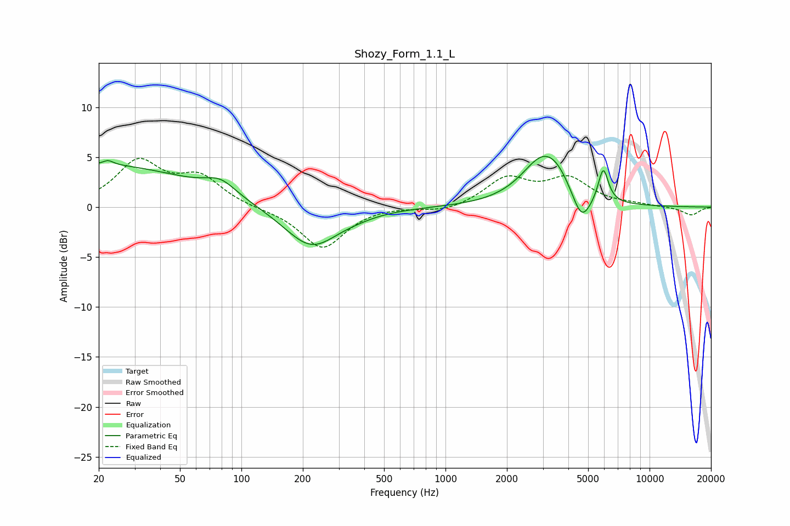

# Shozy_Form_1.1_L
See [usage instructions](https://github.com/jaakkopasanen/AutoEq#usage) for more options and info.

### Parametric EQs
Apply preamp of -5.2 dB when using parametric equalizer.

|   # | Type    |   Fc (Hz) |    Q |   Gain (dB) |
|-----|---------|-----------|------|-------------|
|   1 | Peaking |        20 | 0.3  |         4.2 |
|   2 | Peaking |        22 | 5.95 |        -2.7 |
|   3 | Peaking |        22 | 5.77 |         3.2 |
|   4 | Peaking |        79 | 1.87 |         1.4 |
|   5 | Peaking |       220 | 1.06 |        -4.1 |
|   6 | Peaking |       373 | 1.61 |        -0.2 |
|   7 | Peaking |      3014 | 1.34 |         4.8 |
|   8 | Peaking |      3574 | 2.33 |         1   |
|   9 | Peaking |      4644 | 3.03 |        -3   |
|  10 | Peaking |      5931 | 5.59 |         3.5 |

### Fixed Band EQs
When using fixed band (also called graphic) equalizer, apply preamp of **-5.0 dB** (if available) and set gains manually with these parameters.

|   # | Type    |   Fc (Hz) |    Q |   Gain (dB) |
|-----|---------|-----------|------|-------------|
|   1 | Peaking |        31 | 1.41 |         4.4 |
|   2 | Peaking |        62 | 1.41 |         2.8 |
|   3 | Peaking |       125 | 1.41 |        -0.2 |
|   4 | Peaking |       250 | 1.41 |        -4.1 |
|   5 | Peaking |       500 | 1.41 |         0.1 |
|   6 | Peaking |      1000 | 1.41 |        -0.5 |
|   7 | Peaking |      2000 | 1.41 |         2.8 |
|   8 | Peaking |      4000 | 1.41 |         2.7 |
|   9 | Peaking |      8000 | 1.41 |         0.2 |
|  10 | Peaking |     16000 | 1.41 |        -0.8 |

### Graphs

