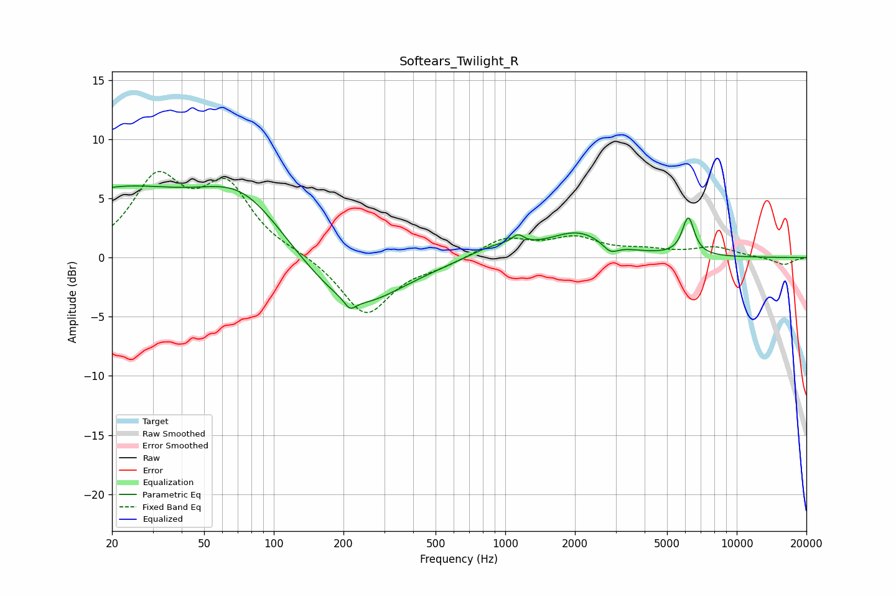

# Softears_Twilight_R
See [usage instructions](https://github.com/jaakkopasanen/AutoEq#usage) for more options and info.

### Parametric EQs
Apply preamp of -6.2 dB when using parametric equalizer.

|   # | Type    |   Fc (Hz) |    Q |   Gain (dB) |
|-----|---------|-----------|------|-------------|
|   1 | Peaking |        20 | 0.41 |         5.4 |
|   2 | Peaking |        74 | 0.75 |         4.8 |
|   3 | Peaking |       213 | 0.65 |        -4.4 |
|   4 | Peaking |       213 | 5.87 |        -0.8 |
|   5 | Peaking |       242 | 1.03 |        -0.5 |
|   6 | Peaking |       905 | 1.19 |         1.1 |
|   7 | Peaking |      1135 | 5.58 |         0.7 |
|   8 | Peaking |      2058 | 1.12 |         2   |
|   9 | Peaking |      2844 | 4.21 |        -0.8 |
|  10 | Peaking |      6176 | 5.32 |         3.2 |

### Fixed Band EQs
When using fixed band (also called graphic) equalizer, apply preamp of **-7.4 dB** (if available) and set gains manually with these parameters.

|   # | Type    |   Fc (Hz) |    Q |   Gain (dB) |
|-----|---------|-----------|------|-------------|
|   1 | Peaking |        31 | 1.41 |         6.2 |
|   2 | Peaking |        62 | 1.41 |         5.6 |
|   3 | Peaking |       125 | 1.41 |         0.3 |
|   4 | Peaking |       250 | 1.41 |        -4.9 |
|   5 | Peaking |       500 | 1.41 |        -0.6 |
|   6 | Peaking |      1000 | 1.41 |         1.6 |
|   7 | Peaking |      2000 | 1.41 |         1.5 |
|   8 | Peaking |      4000 | 1.41 |         0.5 |
|   9 | Peaking |      8000 | 1.41 |         0.8 |
|  10 | Peaking |     16000 | 1.41 |        -0.6 |

### Graphs

