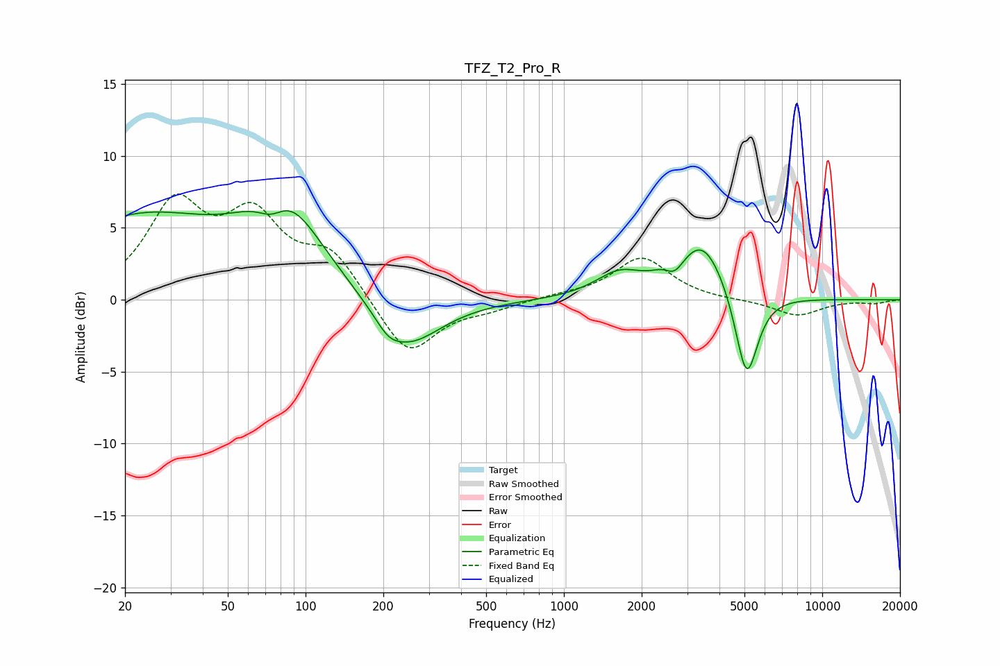

# TFZ_T2_Pro_R
See [usage instructions](https://github.com/jaakkopasanen/AutoEq#usage) for more options and info.

### Parametric EQs
Apply preamp of -6.3 dB when using parametric equalizer.

|   # | Type    |   Fc (Hz) |    Q |   Gain (dB) |
|-----|---------|-----------|------|-------------|
|   1 | Peaking |        23 | 0.43 |         5.5 |
|   2 | Peaking |        74 | 2.46 |        -1.7 |
|   3 | Peaking |        82 | 0.99 |         6.1 |
|   4 | Peaking |       209 | 3.17 |        -0.7 |
|   5 | Peaking |       245 | 1.06 |        -3.6 |
|   6 | Peaking |      1635 | 1.54 |         1.6 |
|   7 | Peaking |      2439 | 3.41 |         0.5 |
|   8 | Peaking |      2671 | 3.87 |        -1   |
|   9 | Peaking |      3436 | 1.5  |         4.1 |
|  10 | Peaking |      5093 | 3.13 |        -6.4 |

### Fixed Band EQs
When using fixed band (also called graphic) equalizer, apply preamp of **-7.5 dB** (if available) and set gains manually with these parameters.

|   # | Type    |   Fc (Hz) |    Q |   Gain (dB) |
|-----|---------|-----------|------|-------------|
|   1 | Peaking |        31 | 1.41 |         6.3 |
|   2 | Peaking |        62 | 1.41 |         5.1 |
|   3 | Peaking |       125 | 1.41 |         3   |
|   4 | Peaking |       250 | 1.41 |        -4   |
|   5 | Peaking |       500 | 1.41 |        -0.5 |
|   6 | Peaking |      1000 | 1.41 |         0.2 |
|   7 | Peaking |      2000 | 1.41 |         2.9 |
|   8 | Peaking |      4000 | 1.41 |        -0.1 |
|   9 | Peaking |      8000 | 1.41 |        -1.1 |
|  10 | Peaking |     16000 | 1.41 |        -0.2 |

### Graphs

