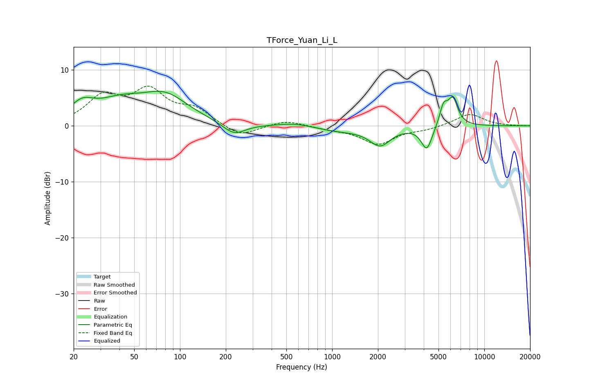

# TForce_Yuan_Li_L
See [usage instructions](https://github.com/jaakkopasanen/AutoEq#usage) for more options and info.

### Parametric EQs
Apply preamp of -6.3 dB when using parametric equalizer.

|   # | Type    |   Fc (Hz) |    Q |   Gain (dB) |
|-----|---------|-----------|------|-------------|
|   1 | Peaking |        23 | 1.8  |         2.9 |
|   2 | Peaking |        40 | 0.91 |         3.3 |
|   3 | Peaking |        80 | 0.91 |         4.8 |
|   4 | Peaking |       227 | 1.91 |        -2.2 |
|   5 | Peaking |       572 | 1.28 |         0.6 |
|   6 | Peaking |      1131 | 0.87 |        -0.9 |
|   7 | Peaking |      2067 | 2.07 |        -3.2 |
|   8 | Peaking |      4188 | 3.88 |        -4.3 |
|   9 | Peaking |      5395 | 5.26 |         3.3 |
|  10 | Peaking |      6204 | 4.11 |         4.7 |

### Fixed Band EQs
When using fixed band (also called graphic) equalizer, apply preamp of **-7.2 dB** (if available) and set gains manually with these parameters.

|   # | Type    |   Fc (Hz) |    Q |   Gain (dB) |
|-----|---------|-----------|------|-------------|
|   1 | Peaking |        31 | 1.41 |         4.8 |
|   2 | Peaking |        62 | 1.41 |         5.8 |
|   3 | Peaking |       125 | 1.41 |         2.6 |
|   4 | Peaking |       250 | 1.41 |        -2.1 |
|   5 | Peaking |       500 | 1.41 |         1   |
|   6 | Peaking |      1000 | 1.41 |        -0.5 |
|   7 | Peaking |      2000 | 1.41 |        -3.2 |
|   8 | Peaking |      4000 | 1.41 |        -0.6 |
|   9 | Peaking |      8000 | 1.41 |         2.2 |
|  10 | Peaking |     16000 | 1.41 |        -0   |

### Graphs

