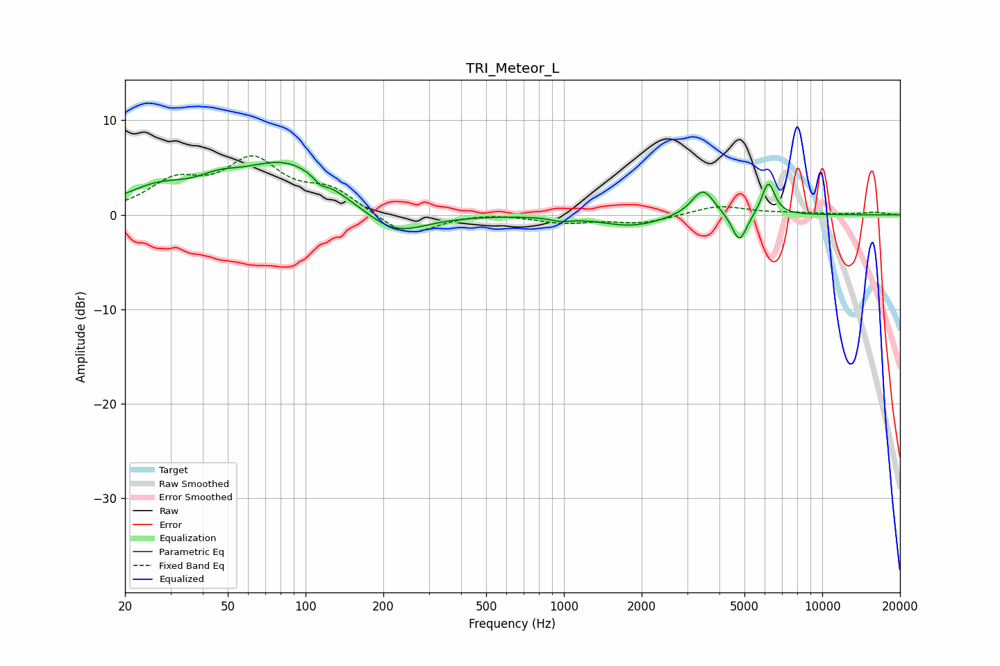

# TRI_Meteor_L
See [usage instructions](https://github.com/jaakkopasanen/AutoEq#usage) for more options and info.

### Parametric EQs
Apply preamp of -5.6 dB when using parametric equalizer.

|   # | Type    |   Fc (Hz) |    Q |   Gain (dB) |
|-----|---------|-----------|------|-------------|
|   1 | Peaking |        26 | 1.12 |         2.2 |
|   2 | Peaking |        46 | 1.71 |         1.3 |
|   3 | Peaking |        85 | 0.76 |         5.5 |
|   4 | Peaking |       114 | 5.66 |        -0.7 |
|   5 | Peaking |       219 | 1.13 |        -2.8 |
|   6 | Peaking |       975 | 3.63 |        -0.4 |
|   7 | Peaking |      1832 | 1.22 |        -1.2 |
|   8 | Peaking |      3456 | 3.18 |         2.9 |
|   9 | Peaking |      4780 | 4.85 |        -3.1 |
|  10 | Peaking |      6186 | 5.44 |         3.5 |

### Fixed Band EQs
When using fixed band (also called graphic) equalizer, apply preamp of **-6.3 dB** (if available) and set gains manually with these parameters.

|   # | Type    |   Fc (Hz) |    Q |   Gain (dB) |
|-----|---------|-----------|------|-------------|
|   1 | Peaking |        31 | 1.41 |         3.1 |
|   2 | Peaking |        62 | 1.41 |         5.3 |
|   3 | Peaking |       125 | 1.41 |         2.4 |
|   4 | Peaking |       250 | 1.41 |        -2.4 |
|   5 | Peaking |       500 | 1.41 |         0.3 |
|   6 | Peaking |      1000 | 1.41 |        -0.8 |
|   7 | Peaking |      2000 | 1.41 |        -0.9 |
|   8 | Peaking |      4000 | 1.41 |         1   |
|   9 | Peaking |      8000 | 1.41 |         0.2 |
|  10 | Peaking |     16000 | 1.41 |         0.3 |

### Graphs

