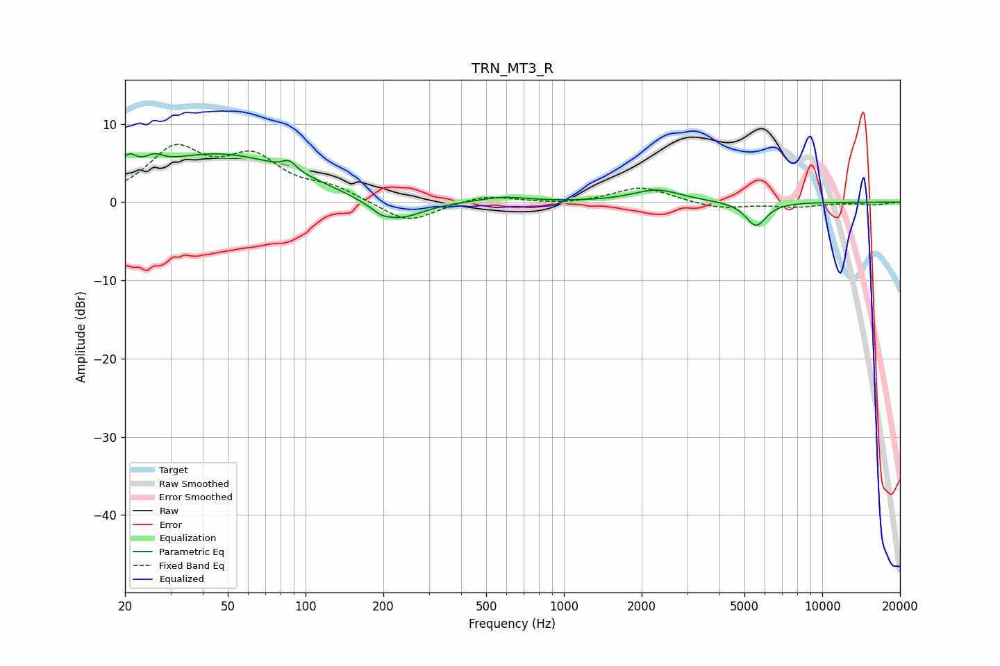

# TRN_MT3_R
See [usage instructions](https://github.com/jaakkopasanen/AutoEq#usage) for more options and info.

### Parametric EQs
Apply preamp of -6.3 dB when using parametric equalizer.

|   # | Type    |   Fc (Hz) |    Q |   Gain (dB) |
|-----|---------|-----------|------|-------------|
|   1 | Peaking |        21 | 4.43 |         2.3 |
|   2 | Peaking |        26 | 4.25 |         1.2 |
|   3 | Peaking |        46 | 0.46 |         6.1 |
|   4 | Peaking |        86 | 5.44 |         1.2 |
|   5 | Peaking |       196 | 5.79 |        -0.4 |
|   6 | Peaking |       214 | 1.26 |        -2.2 |
|   7 | Peaking |       236 | 1.76 |        -0.9 |
|   8 | Peaking |       584 | 1.56 |         0.7 |
|   9 | Peaking |      2291 | 1.52 |         1.6 |
|  10 | Peaking |      5541 | 3.43 |        -3.1 |

### Fixed Band EQs
When using fixed band (also called graphic) equalizer, apply preamp of **-7.5 dB** (if available) and set gains manually with these parameters.

|   # | Type    |   Fc (Hz) |    Q |   Gain (dB) |
|-----|---------|-----------|------|-------------|
|   1 | Peaking |        31 | 1.41 |         6.4 |
|   2 | Peaking |        62 | 1.41 |         5.1 |
|   3 | Peaking |       125 | 1.41 |         1.6 |
|   4 | Peaking |       250 | 1.41 |        -2.8 |
|   5 | Peaking |       500 | 1.41 |         1   |
|   6 | Peaking |      1000 | 1.41 |        -0.3 |
|   7 | Peaking |      2000 | 1.41 |         2   |
|   8 | Peaking |      4000 | 1.41 |        -0.9 |
|   9 | Peaking |      8000 | 1.41 |        -0.6 |
|  10 | Peaking |     16000 | 1.41 |        -0.3 |

### Graphs

