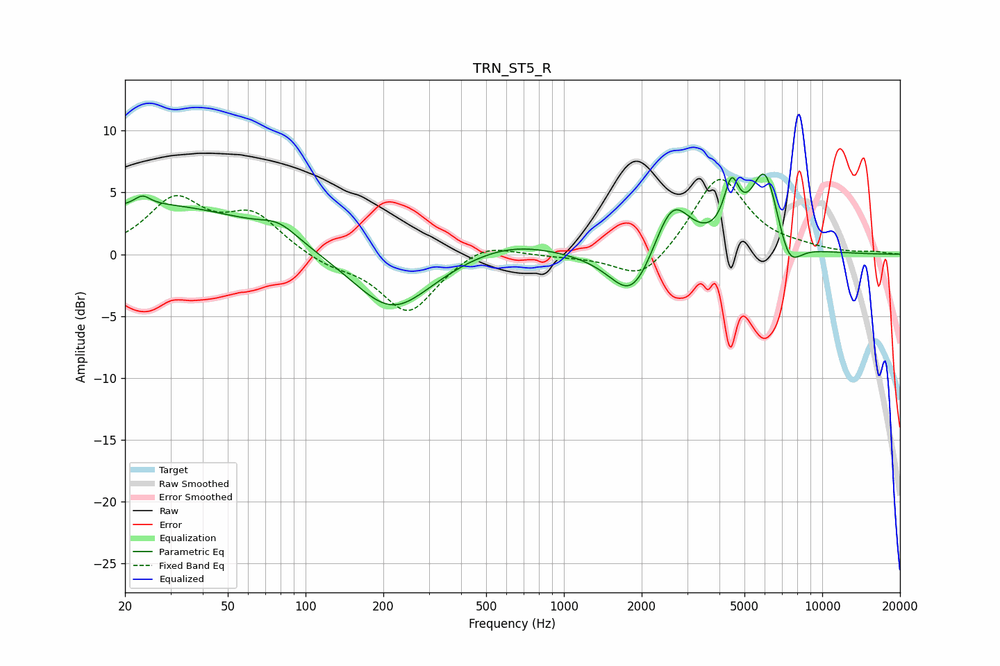

# TRN_ST5_R
See [usage instructions](https://github.com/jaakkopasanen/AutoEq#usage) for more options and info.

### Parametric EQs
Apply preamp of -6.6 dB when using parametric equalizer.

|   # | Type    |   Fc (Hz) |    Q |   Gain (dB) |
|-----|---------|-----------|------|-------------|
|   1 | Peaking |        23 | 4.87 |         0.7 |
|   2 | Peaking |        25 | 0.33 |         4   |
|   3 | Peaking |        79 | 1.94 |         1.1 |
|   4 | Peaking |       216 | 0.92 |        -4.9 |
|   5 | Peaking |       613 | 0.78 |         1.2 |
|   6 | Peaking |      1841 | 1.63 |        -4.2 |
|   7 | Peaking |      2622 | 1.97 |         4.7 |
|   8 | Peaking |      4452 | 4.76 |         4   |
|   9 | Peaking |      6008 | 2.44 |         6.8 |
|  10 | Peaking |      7410 | 2.83 |        -2.8 |

### Fixed Band EQs
When using fixed band (also called graphic) equalizer, apply preamp of **-6.1 dB** (if available) and set gains manually with these parameters.

|   # | Type    |   Fc (Hz) |    Q |   Gain (dB) |
|-----|---------|-----------|------|-------------|
|   1 | Peaking |        31 | 1.41 |         4.2 |
|   2 | Peaking |        62 | 1.41 |         3   |
|   3 | Peaking |       125 | 1.41 |        -0.8 |
|   4 | Peaking |       250 | 1.41 |        -4.7 |
|   5 | Peaking |       500 | 1.41 |         1.1 |
|   6 | Peaking |      1000 | 1.41 |        -0.1 |
|   7 | Peaking |      2000 | 1.41 |        -2.4 |
|   8 | Peaking |      4000 | 1.41 |         6.4 |
|   9 | Peaking |      8000 | 1.41 |         0.3 |
|  10 | Peaking |     16000 | 1.41 |         0.2 |

### Graphs

