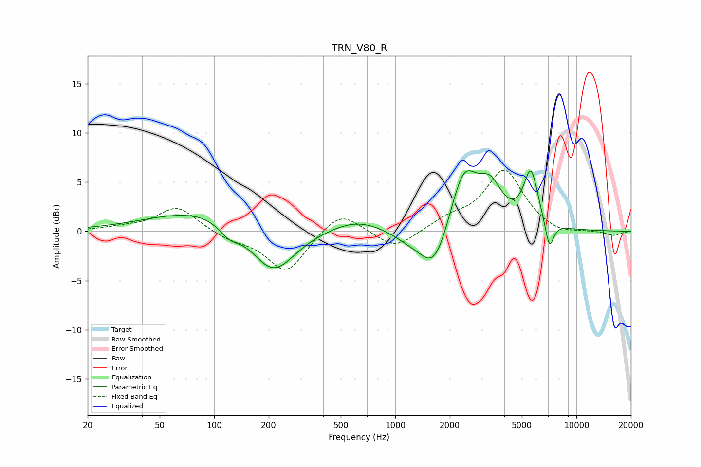

# TRN_V80_R
See [usage instructions](https://github.com/jaakkopasanen/AutoEq#usage) for more options and info.

### Parametric EQs
Apply preamp of -6.3 dB when using parametric equalizer.

|   # | Type    |   Fc (Hz) |    Q |   Gain (dB) |
|-----|---------|-----------|------|-------------|
|   1 | Peaking |        94 | 0.47 |         2.5 |
|   2 | Peaking |       121 | 2.44 |        -1.3 |
|   3 | Peaking |       211 | 1.13 |        -5.2 |
|   4 | Peaking |       621 | 0.94 |         1.3 |
|   5 | Peaking |      1210 | 1.32 |        -0.9 |
|   6 | Peaking |      1649 | 1.73 |        -4.6 |
|   7 | Peaking |      2384 | 1.82 |         6.4 |
|   8 | Peaking |      3347 | 2.16 |         3.5 |
|   9 | Peaking |      5607 | 3.42 |         5.6 |
|  10 | Peaking |      7093 | 5.73 |        -2.9 |

### Fixed Band EQs
When using fixed band (also called graphic) equalizer, apply preamp of **-6.3 dB** (if available) and set gains manually with these parameters.

|   # | Type    |   Fc (Hz) |    Q |   Gain (dB) |
|-----|---------|-----------|------|-------------|
|   1 | Peaking |        31 | 1.41 |         0.3 |
|   2 | Peaking |        62 | 1.41 |         2.5 |
|   3 | Peaking |       125 | 1.41 |        -0.7 |
|   4 | Peaking |       250 | 1.41 |        -4.2 |
|   5 | Peaking |       500 | 1.41 |         2.3 |
|   6 | Peaking |      1000 | 1.41 |        -1.9 |
|   7 | Peaking |      2000 | 1.41 |         1.1 |
|   8 | Peaking |      4000 | 1.41 |         6.2 |
|   9 | Peaking |      8000 | 1.41 |        -0.5 |
|  10 | Peaking |     16000 | 1.41 |        -0.4 |

### Graphs

