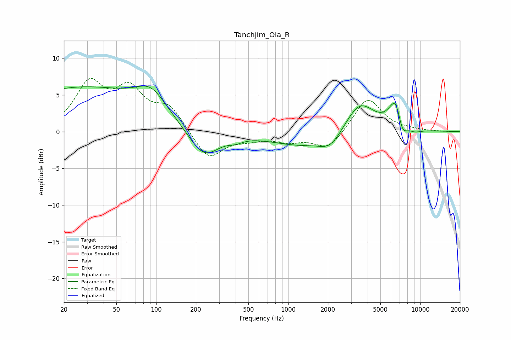

# Tanchjim_Ola_R
See [usage instructions](https://github.com/jaakkopasanen/AutoEq#usage) for more options and info.

### Parametric EQs
Apply preamp of -6.3 dB when using parametric equalizer.

|   # | Type    |   Fc (Hz) |    Q |   Gain (dB) |
|-----|---------|-----------|------|-------------|
|   1 | Peaking |        27 | 0.27 |         5.9 |
|   2 | Peaking |        91 | 1.26 |         3   |
|   3 | Peaking |       229 | 1.23 |        -4   |
|   4 | Peaking |       401 | 2.69 |        -0.5 |
|   5 | Peaking |      1248 | 0.59 |        -1.8 |
|   6 | Peaking |      2094 | 1.66 |        -1.9 |
|   7 | Peaking |      3481 | 1.27 |         4.2 |
|   8 | Peaking |      6581 | 2.65 |         4.7 |
|   9 | Peaking |      7271 | 3.54 |        -3   |
|  10 | Peaking |      9065 | 2.39 |        -0.5 |

### Fixed Band EQs
When using fixed band (also called graphic) equalizer, apply preamp of **-7.3 dB** (if available) and set gains manually with these parameters.

|   # | Type    |   Fc (Hz) |    Q |   Gain (dB) |
|-----|---------|-----------|------|-------------|
|   1 | Peaking |        31 | 1.41 |         6.2 |
|   2 | Peaking |        62 | 1.41 |         5.1 |
|   3 | Peaking |       125 | 1.41 |         3.1 |
|   4 | Peaking |       250 | 1.41 |        -3.9 |
|   5 | Peaking |       500 | 1.41 |        -0.8 |
|   6 | Peaking |      1000 | 1.41 |        -1.1 |
|   7 | Peaking |      2000 | 1.41 |        -2.4 |
|   8 | Peaking |      4000 | 1.41 |         4.7 |
|   9 | Peaking |      8000 | 1.41 |         0.1 |
|  10 | Peaking |     16000 | 1.41 |        -0   |

### Graphs

