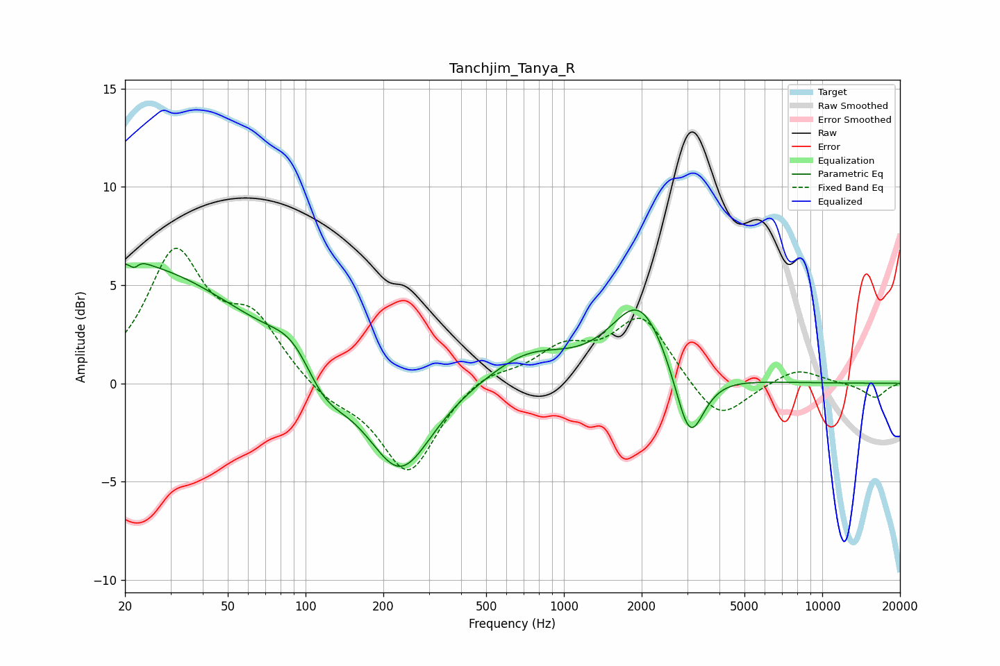

# Tanchjim_Tanya_R
See [usage instructions](https://github.com/jaakkopasanen/AutoEq#usage) for more options and info.

### Parametric EQs
Apply preamp of -6.2 dB when using parametric equalizer.

|   # | Type    |   Fc (Hz) |    Q |   Gain (dB) |
|-----|---------|-----------|------|-------------|
|   1 | Peaking |        21 | 0.33 |         6   |
|   2 | Peaking |        22 | 5.84 |        -3.6 |
|   3 | Peaking |        22 | 5.35 |         3.5 |
|   4 | Peaking |        88 | 1.53 |         0.6 |
|   5 | Peaking |        91 | 1.67 |         0.9 |
|   6 | Peaking |       117 | 1.61 |        -1.7 |
|   7 | Peaking |       232 | 1.15 |        -4.7 |
|   8 | Peaking |       731 | 0.9  |         1.5 |
|   9 | Peaking |      1964 | 1.29 |         4   |
|  10 | Peaking |      3066 | 2.54 |        -3.9 |

### Fixed Band EQs
When using fixed band (also called graphic) equalizer, apply preamp of **-7.0 dB** (if available) and set gains manually with these parameters.

|   # | Type    |   Fc (Hz) |    Q |   Gain (dB) |
|-----|---------|-----------|------|-------------|
|   1 | Peaking |        31 | 1.41 |         6.4 |
|   2 | Peaking |        62 | 1.41 |         2.9 |
|   3 | Peaking |       125 | 1.41 |        -0.8 |
|   4 | Peaking |       250 | 1.41 |        -4.6 |
|   5 | Peaking |       500 | 1.41 |         0.7 |
|   6 | Peaking |      1000 | 1.41 |         1.6 |
|   7 | Peaking |      2000 | 1.41 |         3.3 |
|   8 | Peaking |      4000 | 1.41 |        -2.1 |
|   9 | Peaking |      8000 | 1.41 |         0.8 |
|  10 | Peaking |     16000 | 1.41 |        -0.7 |

### Graphs

