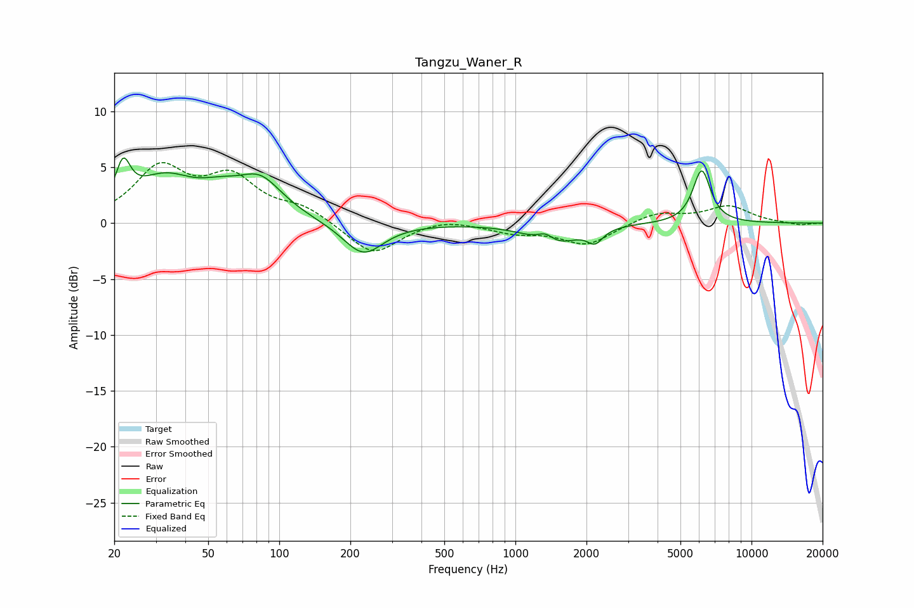

# Tangzu_Waner_R
See [usage instructions](https://github.com/jaakkopasanen/AutoEq#usage) for more options and info.

### Parametric EQs
Apply preamp of -5.9 dB when using parametric equalizer.

|   # | Type    |   Fc (Hz) |    Q |   Gain (dB) |
|-----|---------|-----------|------|-------------|
|   1 | Peaking |        22 | 4.67 |         3.5 |
|   2 | Peaking |        33 | 1.06 |         3.7 |
|   3 | Peaking |        55 | 1.79 |         0.9 |
|   4 | Peaking |        75 | 2.19 |        -0.6 |
|   5 | Peaking |        80 | 1.41 |         4.1 |
|   6 | Peaking |       227 | 1.66 |        -3   |
|   7 | Peaking |      1344 | 3.83 |         1   |
|   8 | Peaking |      1439 | 1.49 |        -2   |
|   9 | Peaking |      2176 | 4.41 |        -1.2 |
|  10 | Peaking |      6152 | 3.71 |         4.7 |

### Fixed Band EQs
When using fixed band (also called graphic) equalizer, apply preamp of **-5.5 dB** (if available) and set gains manually with these parameters.

|   # | Type    |   Fc (Hz) |    Q |   Gain (dB) |
|-----|---------|-----------|------|-------------|
|   1 | Peaking |        31 | 1.41 |         4.7 |
|   2 | Peaking |        62 | 1.41 |         3.7 |
|   3 | Peaking |       125 | 1.41 |         1.3 |
|   4 | Peaking |       250 | 1.41 |        -2.9 |
|   5 | Peaking |       500 | 1.41 |         0.5 |
|   6 | Peaking |      1000 | 1.41 |        -0.8 |
|   7 | Peaking |      2000 | 1.41 |        -1.9 |
|   8 | Peaking |      4000 | 1.41 |         1   |
|   9 | Peaking |      8000 | 1.41 |         1.5 |
|  10 | Peaking |     16000 | 1.41 |        -0.2 |

### Graphs

