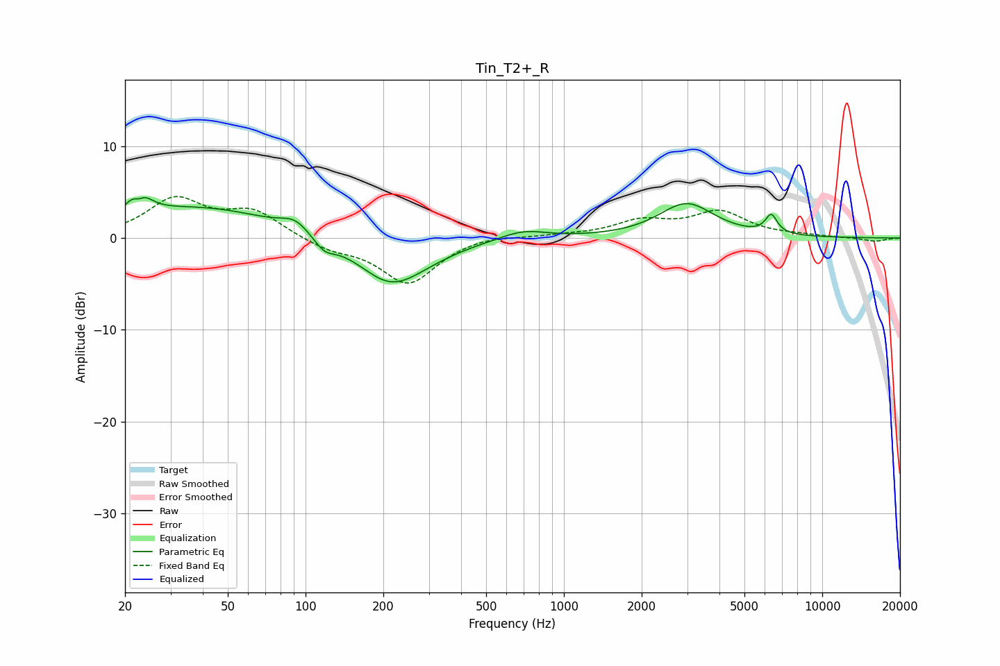

# Tin_T2+_R
See [usage instructions](https://github.com/jaakkopasanen/AutoEq#usage) for more options and info.

### Parametric EQs
Apply preamp of -4.5 dB when using parametric equalizer.

|   # | Type    |   Fc (Hz) |    Q |   Gain (dB) |
|-----|---------|-----------|------|-------------|
|   1 | Peaking |        23 | 4.04 |         4.2 |
|   2 | Peaking |        23 | 5.99 |        -2.5 |
|   3 | Peaking |        39 | 0.46 |         3.3 |
|   4 | Peaking |        91 | 2.66 |         1.3 |
|   5 | Peaking |       118 | 3.38 |        -1.3 |
|   6 | Peaking |       213 | 1.1  |        -4.9 |
|   7 | Peaking |       290 | 1    |        -0.6 |
|   8 | Peaking |       695 | 1.54 |         1   |
|   9 | Peaking |      2983 | 1.32 |         3.7 |
|  10 | Peaking |      6349 | 6    |         2   |

### Fixed Band EQs
When using fixed band (also called graphic) equalizer, apply preamp of **-4.6 dB** (if available) and set gains manually with these parameters.

|   # | Type    |   Fc (Hz) |    Q |   Gain (dB) |
|-----|---------|-----------|------|-------------|
|   1 | Peaking |        31 | 1.41 |         4.1 |
|   2 | Peaking |        62 | 1.41 |         2.8 |
|   3 | Peaking |       125 | 1.41 |        -1.1 |
|   4 | Peaking |       250 | 1.41 |        -4.9 |
|   5 | Peaking |       500 | 1.41 |         0.4 |
|   6 | Peaking |      1000 | 1.41 |         0.2 |
|   7 | Peaking |      2000 | 1.41 |         1.7 |
|   8 | Peaking |      4000 | 1.41 |         2.7 |
|   9 | Peaking |      8000 | 1.41 |         0.2 |
|  10 | Peaking |     16000 | 1.41 |        -0.4 |

### Graphs

