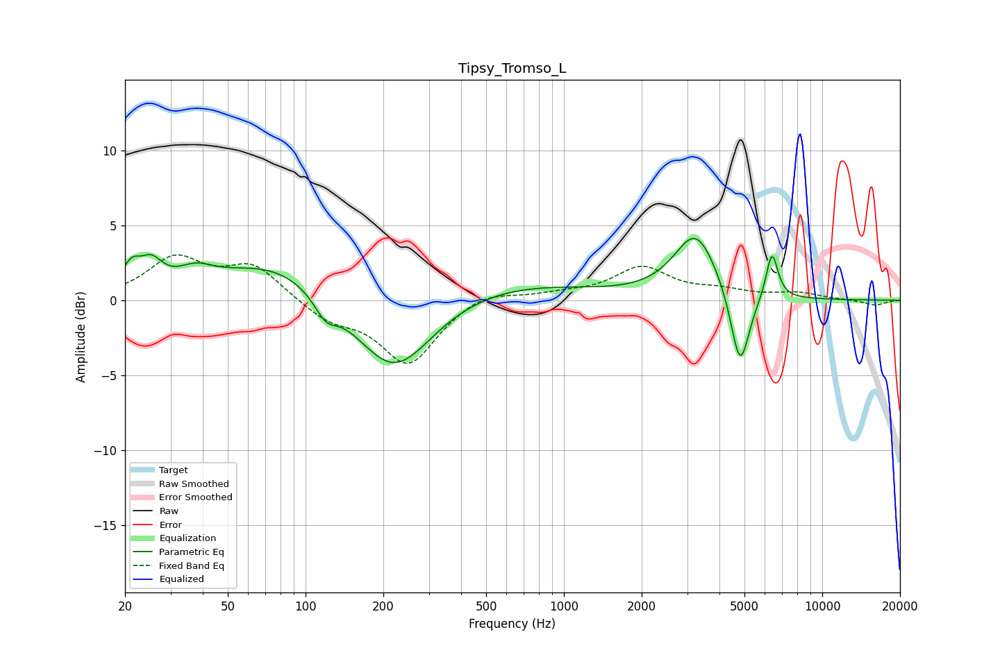

# Tipsy_Tromso_L
See [usage instructions](https://github.com/jaakkopasanen/AutoEq#usage) for more options and info.

### Parametric EQs
Apply preamp of -4.2 dB when using parametric equalizer.

|   # | Type    |   Fc (Hz) |    Q |   Gain (dB) |
|-----|---------|-----------|------|-------------|
|   1 | Peaking |        21 | 4.21 |         1.5 |
|   2 | Peaking |        25 | 3.17 |         1.7 |
|   3 | Peaking |        37 | 2.03 |         1   |
|   4 | Peaking |        76 | 0.63 |         2.6 |
|   5 | Peaking |       120 | 3.17 |        -1.4 |
|   6 | Peaking |       219 | 0.94 |        -5.4 |
|   7 | Peaking |       586 | 0.44 |         1.2 |
|   8 | Peaking |      3239 | 1.69 |         4.4 |
|   9 | Peaking |      4809 | 3.82 |        -5.4 |
|  10 | Peaking |      6389 | 6    |         3.1 |

### Fixed Band EQs
When using fixed band (also called graphic) equalizer, apply preamp of **-3.1 dB** (if available) and set gains manually with these parameters.

|   # | Type    |   Fc (Hz) |    Q |   Gain (dB) |
|-----|---------|-----------|------|-------------|
|   1 | Peaking |        31 | 1.41 |         2.7 |
|   2 | Peaking |        62 | 1.41 |         2.2 |
|   3 | Peaking |       125 | 1.41 |        -1.2 |
|   4 | Peaking |       250 | 1.41 |        -4.2 |
|   5 | Peaking |       500 | 1.41 |         0.7 |
|   6 | Peaking |      1000 | 1.41 |         0.3 |
|   7 | Peaking |      2000 | 1.41 |         2.1 |
|   8 | Peaking |      4000 | 1.41 |         0.5 |
|   9 | Peaking |      8000 | 1.41 |         0.4 |
|  10 | Peaking |     16000 | 1.41 |        -0.3 |

### Graphs

