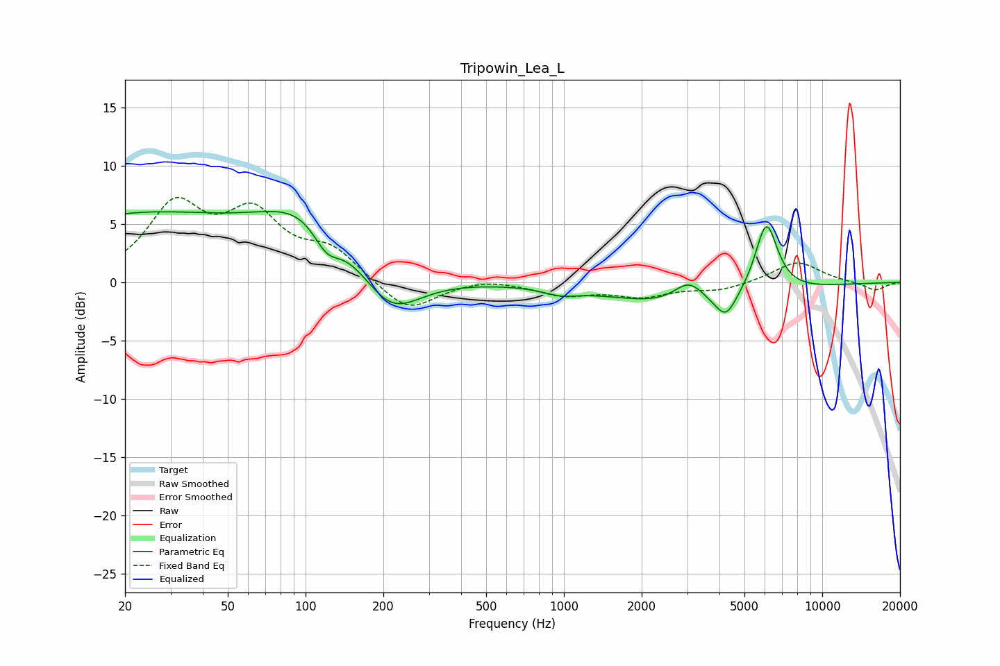

# Tripowin_Lea_L
See [usage instructions](https://github.com/jaakkopasanen/AutoEq#usage) for more options and info.

### Parametric EQs
Apply preamp of -6.2 dB when using parametric equalizer.

|   # | Type    |   Fc (Hz) |    Q |   Gain (dB) |
|-----|---------|-----------|------|-------------|
|   1 | Peaking |        22 | 0.31 |         5.6 |
|   2 | Peaking |       106 | 0.73 |         5.2 |
|   3 | Peaking |       121 | 2.54 |        -2.5 |
|   4 | Peaking |       212 | 1.19 |        -4.3 |
|   5 | Peaking |       973 | 2.16 |        -0.6 |
|   6 | Peaking |      3054 | 2.33 |         2   |
|   7 | Peaking |      3201 | 0.51 |        -2.2 |
|   8 | Peaking |      4170 | 4.01 |         0.8 |
|   9 | Peaking |      4210 | 3.6  |        -2.8 |
|  10 | Peaking |      6074 | 3.06 |         6.3 |

### Fixed Band EQs
When using fixed band (also called graphic) equalizer, apply preamp of **-7.4 dB** (if available) and set gains manually with these parameters.

|   # | Type    |   Fc (Hz) |    Q |   Gain (dB) |
|-----|---------|-----------|------|-------------|
|   1 | Peaking |        31 | 1.41 |         6.2 |
|   2 | Peaking |        62 | 1.41 |         5.2 |
|   3 | Peaking |       125 | 1.41 |         2.5 |
|   4 | Peaking |       250 | 1.41 |        -2.7 |
|   5 | Peaking |       500 | 1.41 |         0.4 |
|   6 | Peaking |      1000 | 1.41 |        -1   |
|   7 | Peaking |      2000 | 1.41 |        -1.1 |
|   8 | Peaking |      4000 | 1.41 |        -0.7 |
|   9 | Peaking |      8000 | 1.41 |         1.8 |
|  10 | Peaking |     16000 | 1.41 |        -0.7 |

### Graphs

