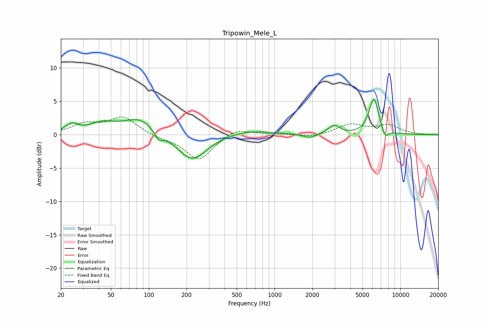

# Tripowin_Mele_L
See [usage instructions](https://github.com/jaakkopasanen/AutoEq#usage) for more options and info.

### Parametric EQs
Apply preamp of -5.3 dB when using parametric equalizer.

|   # | Type    |   Fc (Hz) |    Q |   Gain (dB) |
|-----|---------|-----------|------|-------------|
|   1 | Peaking |        24 | 2.98 |         1.2 |
|   2 | Peaking |        42 | 1.34 |         1.4 |
|   3 | Peaking |        84 | 1.12 |         2.4 |
|   4 | Peaking |       120 | 4.35 |        -1.2 |
|   5 | Peaking |       221 | 1.2  |        -4   |
|   6 | Peaking |       614 | 0.77 |         0.7 |
|   7 | Peaking |      1910 | 2.55 |        -0.6 |
|   8 | Peaking |      2950 | 3.13 |         1.3 |
|   9 | Peaking |      6149 | 3.59 |         5.4 |
|  10 | Peaking |      7581 | 5.29 |        -1.4 |

### Fixed Band EQs
When using fixed band (also called graphic) equalizer, apply preamp of **-2.8 dB** (if available) and set gains manually with these parameters.

|   # | Type    |   Fc (Hz) |    Q |   Gain (dB) |
|-----|---------|-----------|------|-------------|
|   1 | Peaking |        31 | 1.41 |         1.5 |
|   2 | Peaking |        62 | 1.41 |         2.6 |
|   3 | Peaking |       125 | 1.41 |        -0.4 |
|   4 | Peaking |       250 | 1.41 |        -3.8 |
|   5 | Peaking |       500 | 1.41 |         1.1 |
|   6 | Peaking |      1000 | 1.41 |         0.1 |
|   7 | Peaking |      2000 | 1.41 |        -0.4 |
|   8 | Peaking |      4000 | 1.41 |         1.5 |
|   9 | Peaking |      8000 | 1.41 |         1.3 |
|  10 | Peaking |     16000 | 1.41 |        -0   |

### Graphs

