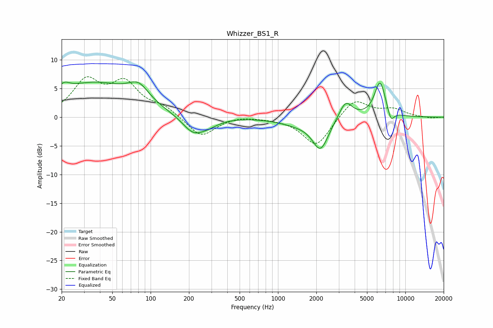

# Whizzer_BS1_R
See [usage instructions](https://github.com/jaakkopasanen/AutoEq#usage) for more options and info.

### Parametric EQs
Apply preamp of -6.3 dB when using parametric equalizer.

|   # | Type    |   Fc (Hz) |    Q |   Gain (dB) |
|-----|---------|-----------|------|-------------|
|   1 | Peaking |        21 | 3.16 |         1.5 |
|   2 | Peaking |        36 | 0.46 |         5.8 |
|   3 | Peaking |        80 | 1.75 |         2.8 |
|   4 | Peaking |       216 | 1.6  |        -3   |
|   5 | Peaking |       285 | 1.75 |        -0.9 |
|   6 | Peaking |      1407 | 0.98 |        -1   |
|   7 | Peaking |      2157 | 2.22 |        -5.4 |
|   8 | Peaking |      3393 | 2.68 |         3.2 |
|   9 | Peaking |      6329 | 3.1  |         6.2 |
|  10 | Peaking |      7695 | 5.17 |        -2.1 |

### Fixed Band EQs
When using fixed band (also called graphic) equalizer, apply preamp of **-7.2 dB** (if available) and set gains manually with these parameters.

|   # | Type    |   Fc (Hz) |    Q |   Gain (dB) |
|-----|---------|-----------|------|-------------|
|   1 | Peaking |        31 | 1.41 |         6   |
|   2 | Peaking |        62 | 1.41 |         5.4 |
|   3 | Peaking |       125 | 1.41 |         1.6 |
|   4 | Peaking |       250 | 1.41 |        -3.5 |
|   5 | Peaking |       500 | 1.41 |         0.3 |
|   6 | Peaking |      1000 | 1.41 |        -0.1 |
|   7 | Peaking |      2000 | 1.41 |        -5.1 |
|   8 | Peaking |      4000 | 1.41 |         3.3 |
|   9 | Peaking |      8000 | 1.41 |         1.3 |
|  10 | Peaking |     16000 | 1.41 |        -0.2 |

### Graphs

