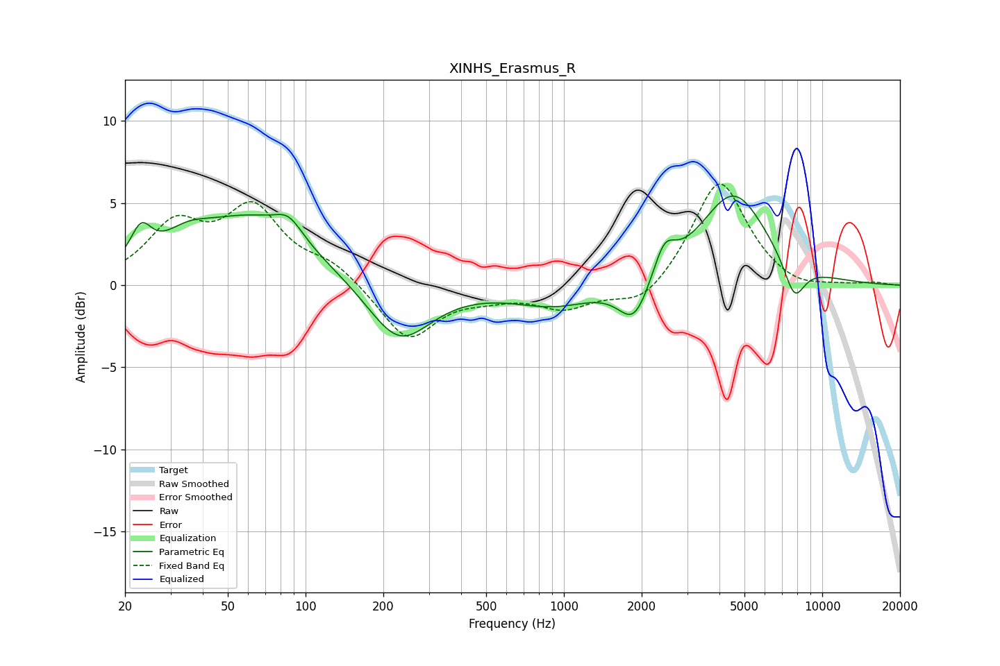

# XINHS_Erasmus_R
See [usage instructions](https://github.com/jaakkopasanen/AutoEq#usage) for more options and info.

### Parametric EQs
Apply preamp of -5.5 dB when using parametric equalizer.

|   # | Type    |   Fc (Hz) |    Q |   Gain (dB) |
|-----|---------|-----------|------|-------------|
|   1 | Peaking |        23 | 3.54 |         2.1 |
|   2 | Peaking |        35 | 1.59 |         1.2 |
|   3 | Peaking |        62 | 0.62 |         4   |
|   4 | Peaking |        86 | 2.68 |         1.2 |
|   5 | Peaking |       230 | 1.15 |        -3.7 |
|   6 | Peaking |       918 | 0.88 |        -1.2 |
|   7 | Peaking |      1871 | 2.34 |        -2.6 |
|   8 | Peaking |      2447 | 3.38 |         1.9 |
|   9 | Peaking |      4537 | 1.06 |         5.6 |
|  10 | Peaking |      7798 | 3.21 |        -2.3 |

### Fixed Band EQs
When using fixed band (also called graphic) equalizer, apply preamp of **-6.3 dB** (if available) and set gains manually with these parameters.

|   # | Type    |   Fc (Hz) |    Q |   Gain (dB) |
|-----|---------|-----------|------|-------------|
|   1 | Peaking |        31 | 1.41 |         3.4 |
|   2 | Peaking |        62 | 1.41 |         4.4 |
|   3 | Peaking |       125 | 1.41 |         1.2 |
|   4 | Peaking |       250 | 1.41 |        -3.4 |
|   5 | Peaking |       500 | 1.41 |        -0.5 |
|   6 | Peaking |      1000 | 1.41 |        -1.3 |
|   7 | Peaking |      2000 | 1.41 |        -1.4 |
|   8 | Peaking |      4000 | 1.41 |         6.5 |
|   9 | Peaking |      8000 | 1.41 |        -0.5 |
|  10 | Peaking |     16000 | 1.41 |         0.1 |

### Graphs

