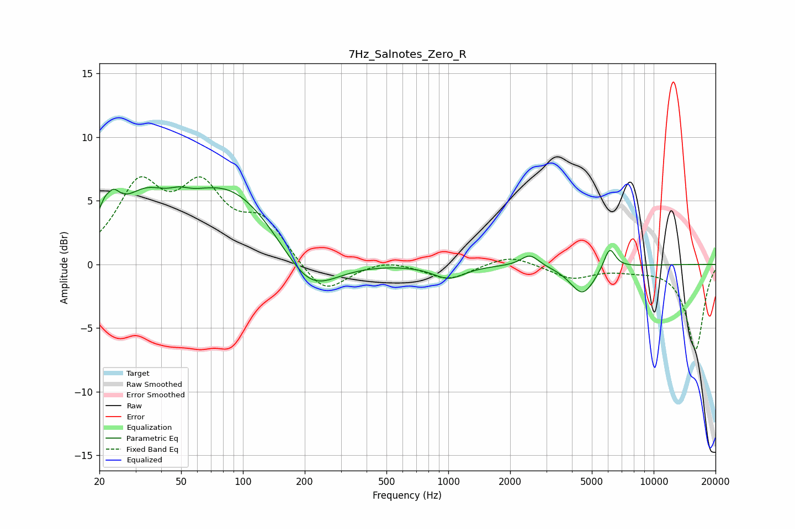

# 7Hz_Salnotes_Zero_R
See [usage instructions](https://github.com/jaakkopasanen/AutoEq#usage) for more options and info.

### Parametric EQs
Apply preamp of -6.2 dB when using parametric equalizer.

|   # | Type    |   Fc (Hz) |    Q |   Gain (dB) |
|-----|---------|-----------|------|-------------|
|   1 | Peaking |        22 | 3.72 |         4.6 |
|   2 | Peaking |        22 | 6    |        -1.8 |
|   3 | Peaking |        33 | 1.23 |         3.2 |
|   4 | Peaking |        49 | 3.04 |         0.5 |
|   5 | Peaking |        86 | 0.57 |         6   |
|   6 | Peaking |       210 | 1.03 |        -3.7 |
|   7 | Peaking |      1004 | 1.86 |        -1.1 |
|   8 | Peaking |      2498 | 3.25 |         0.9 |
|   9 | Peaking |      4504 | 2.28 |        -2.3 |
|  10 | Peaking |      6101 | 4.8  |         1.8 |

### Fixed Band EQs
When using fixed band (also called graphic) equalizer, apply preamp of **-7.0 dB** (if available) and set gains manually with these parameters.

|   # | Type    |   Fc (Hz) |    Q |   Gain (dB) |
|-----|---------|-----------|------|-------------|
|   1 | Peaking |        31 | 1.41 |         5.8 |
|   2 | Peaking |        62 | 1.41 |         5.3 |
|   3 | Peaking |       125 | 1.41 |         3.1 |
|   4 | Peaking |       250 | 1.41 |        -2.5 |
|   5 | Peaking |       500 | 1.41 |         0.5 |
|   6 | Peaking |      1000 | 1.41 |        -1.2 |
|   7 | Peaking |      2000 | 1.41 |         0.8 |
|   8 | Peaking |      4000 | 1.41 |        -1.1 |
|   9 | Peaking |      8000 | 1.41 |        -0.3 |
|  10 | Peaking |     16000 | 1.41 |        -6.7 |

### Graphs

