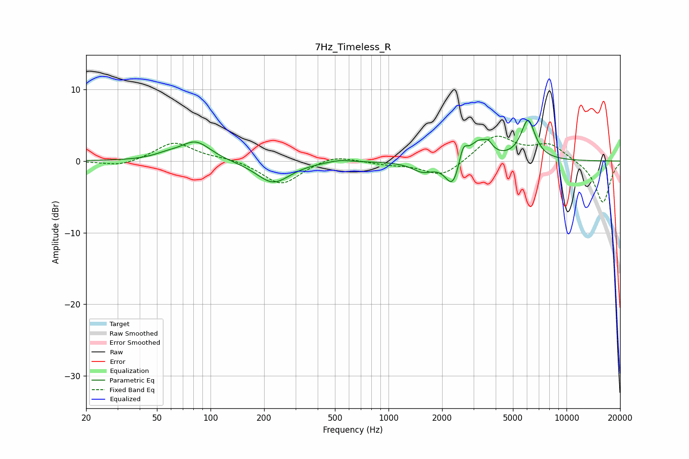

# 7Hz_Timeless_R
See [usage instructions](https://github.com/jaakkopasanen/AutoEq#usage) for more options and info.

### Parametric EQs
Apply preamp of -5.8 dB when using parametric equalizer.

|   # | Type    |   Fc (Hz) |    Q |   Gain (dB) |
|-----|---------|-----------|------|-------------|
|   1 | Peaking |        57 | 1.95 |         0.5 |
|   2 | Peaking |        83 | 1.67 |         2.7 |
|   3 | Peaking |       225 | 1.51 |        -3.1 |
|   4 | Peaking |       528 | 2.12 |         0.4 |
|   5 | Peaking |      1556 | 2.33 |        -1.4 |
|   6 | Peaking |      2300 | 3.43 |        -3.9 |
|   7 | Peaking |      2625 | 6    |         2.6 |
|   8 | Peaking |      3199 | 2.6  |         2.7 |
|   9 | Peaking |      3634 | 6    |         1   |
|  10 | Peaking |      6081 | 3.45 |         5.5 |

### Fixed Band EQs
When using fixed band (also called graphic) equalizer, apply preamp of **-3.6 dB** (if available) and set gains manually with these parameters.

|   # | Type    |   Fc (Hz) |    Q |   Gain (dB) |
|-----|---------|-----------|------|-------------|
|   1 | Peaking |        31 | 1.41 |        -0.8 |
|   2 | Peaking |        62 | 1.41 |         2.7 |
|   3 | Peaking |       125 | 1.41 |         0.4 |
|   4 | Peaking |       250 | 1.41 |        -3.4 |
|   5 | Peaking |       500 | 1.41 |         1   |
|   6 | Peaking |      1000 | 1.41 |        -0.4 |
|   7 | Peaking |      2000 | 1.41 |        -2.3 |
|   8 | Peaking |      4000 | 1.41 |         3.6 |
|   9 | Peaking |      8000 | 1.41 |         2.2 |
|  10 | Peaking |     16000 | 1.41 |        -5.9 |

### Graphs

