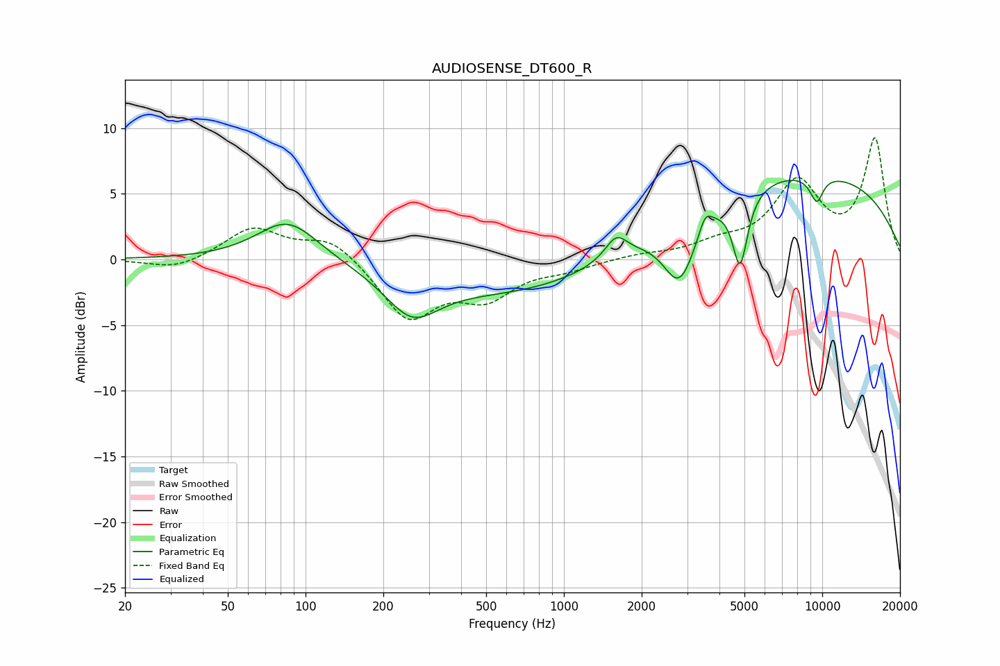

# AUDIOSENSE_DT600_R
See [usage instructions](https://github.com/jaakkopasanen/AutoEq#usage) for more options and info.

### Parametric EQs
Apply preamp of -6.1 dB when using parametric equalizer.

|   # | Type    |   Fc (Hz) |    Q |   Gain (dB) |
|-----|---------|-----------|------|-------------|
|   1 | Peaking |        85 | 1.19 |         3.2 |
|   2 | Peaking |       258 | 1.39 |        -3.1 |
|   3 | Peaking |       836 | 0.31 |        -3   |
|   4 | Peaking |      1595 | 3.33 |         1.7 |
|   5 | Peaking |      2809 | 2.2  |        -5   |
|   6 | Peaking |      3526 | 5.81 |         1.3 |
|   7 | Peaking |      4808 | 4.77 |        -5.5 |
|   8 | Peaking |      7447 | 0.22 |         6.9 |
|   9 | Peaking |      9416 | 5.94 |         2.1 |
|  10 | Peaking |      9458 | 5.23 |        -4.1 |

### Fixed Band EQs
When using fixed band (also called graphic) equalizer, apply preamp of **-9.3 dB** (if available) and set gains manually with these parameters.

|   # | Type    |   Fc (Hz) |    Q |   Gain (dB) |
|-----|---------|-----------|------|-------------|
|   1 | Peaking |        31 | 1.41 |        -0.8 |
|   2 | Peaking |        62 | 1.41 |         2.4 |
|   3 | Peaking |       125 | 1.41 |         1.7 |
|   4 | Peaking |       250 | 1.41 |        -4.4 |
|   5 | Peaking |       500 | 1.41 |        -2.6 |
|   6 | Peaking |      1000 | 1.41 |        -0.6 |
|   7 | Peaking |      2000 | 1.41 |         0.3 |
|   8 | Peaking |      4000 | 1.41 |         1   |
|   9 | Peaking |      8000 | 1.41 |         5.6 |
|  10 | Peaking |     16000 | 1.41 |         9   |

### Graphs

