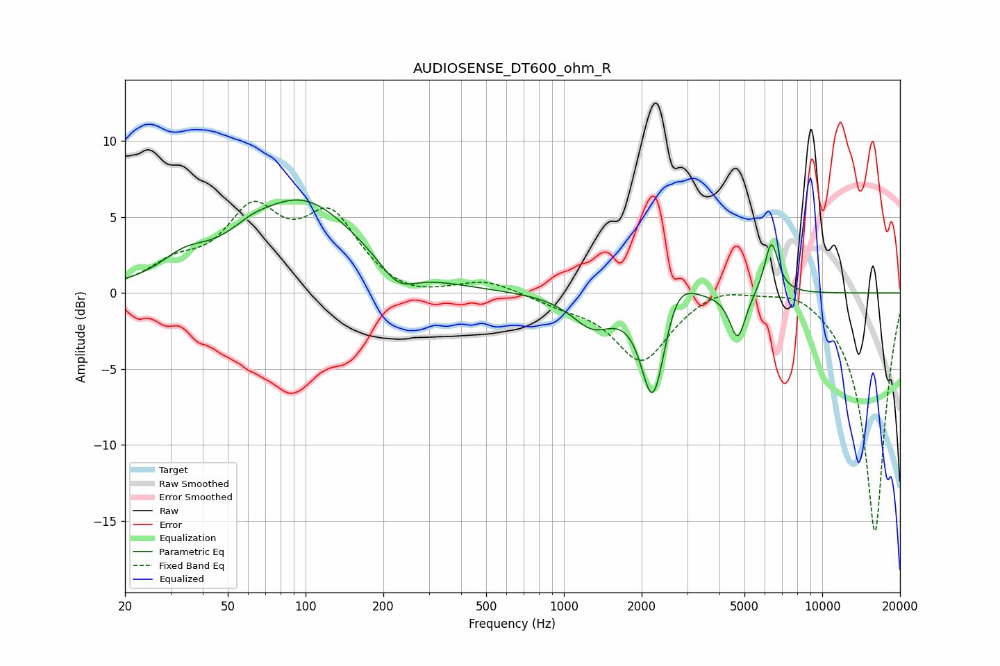

# AUDIOSENSE_DT600_ohm_R
See [usage instructions](https://github.com/jaakkopasanen/AutoEq#usage) for more options and info.

### Parametric EQs
Apply preamp of -6.2 dB when using parametric equalizer.

|   # | Type    |   Fc (Hz) |    Q |   Gain (dB) |
|-----|---------|-----------|------|-------------|
|   1 | Peaking |        34 | 1.58 |         1.3 |
|   2 | Peaking |        61 | 1.91 |         0.6 |
|   3 | Peaking |        97 | 0.65 |         6   |
|   4 | Peaking |       228 | 2.02 |        -1.6 |
|   5 | Peaking |      1292 | 1.74 |        -2   |
|   6 | Peaking |      2197 | 3.15 |        -6.4 |
|   7 | Peaking |      2357 | 3.44 |        -1.1 |
|   8 | Peaking |      2714 | 2.25 |         2.1 |
|   9 | Peaking |      4706 | 4.57 |        -3.1 |
|  10 | Peaking |      6357 | 5.06 |         3.5 |

### Fixed Band EQs
When using fixed band (also called graphic) equalizer, apply preamp of **-6.1 dB** (if available) and set gains manually with these parameters.

|   # | Type    |   Fc (Hz) |    Q |   Gain (dB) |
|-----|---------|-----------|------|-------------|
|   1 | Peaking |        31 | 1.41 |         1.5 |
|   2 | Peaking |        62 | 1.41 |         4.9 |
|   3 | Peaking |       125 | 1.41 |         4.7 |
|   4 | Peaking |       250 | 1.41 |        -0.6 |
|   5 | Peaking |       500 | 1.41 |         0.8 |
|   6 | Peaking |      1000 | 1.41 |        -0.6 |
|   7 | Peaking |      2000 | 1.41 |        -4.4 |
|   8 | Peaking |      4000 | 1.41 |         0.7 |
|   9 | Peaking |      8000 | 1.41 |         0.7 |
|  10 | Peaking |     16000 | 1.41 |       -15.8 |

### Graphs

