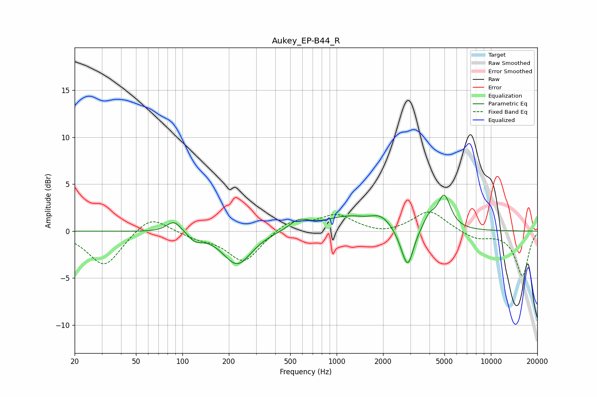

# Aukey_EP-B44_R
See [usage instructions](https://github.com/jaakkopasanen/AutoEq#usage) for more options and info.

### Parametric EQs
Apply preamp of -3.9 dB when using parametric equalizer.

|   # | Type    |   Fc (Hz) |    Q |   Gain (dB) |
|-----|---------|-----------|------|-------------|
|   1 | Peaking |        88 | 2.98 |         1.3 |
|   2 | Peaking |       121 | 3.3  |        -0.7 |
|   3 | Peaking |       227 | 1.53 |        -3.6 |
|   4 | Peaking |       571 | 2.22 |         1.1 |
|   5 | Peaking |      1172 | 0.93 |         1.4 |
|   6 | Peaking |      1944 | 2.08 |         1.1 |
|   7 | Peaking |      2644 | 3.29 |        -0.6 |
|   8 | Peaking |      2898 | 3.87 |        -3.9 |
|   9 | Peaking |      3987 | 3.78 |         1.2 |
|  10 | Peaking |      4980 | 3.28 |         3.6 |

### Fixed Band EQs
When using fixed band (also called graphic) equalizer, apply preamp of **-2.1 dB** (if available) and set gains manually with these parameters.

|   # | Type    |   Fc (Hz) |    Q |   Gain (dB) |
|-----|---------|-----------|------|-------------|
|   1 | Peaking |        31 | 1.41 |        -3.8 |
|   2 | Peaking |        62 | 1.41 |         1.9 |
|   3 | Peaking |       125 | 1.41 |        -0.6 |
|   4 | Peaking |       250 | 1.41 |        -3.3 |
|   5 | Peaking |       500 | 1.41 |         1.2 |
|   6 | Peaking |      1000 | 1.41 |         1.7 |
|   7 | Peaking |      2000 | 1.41 |        -0.4 |
|   8 | Peaking |      4000 | 1.41 |         2.2 |
|   9 | Peaking |      8000 | 1.41 |        -0.8 |
|  10 | Peaking |     16000 | 1.41 |        -4.7 |

### Graphs

