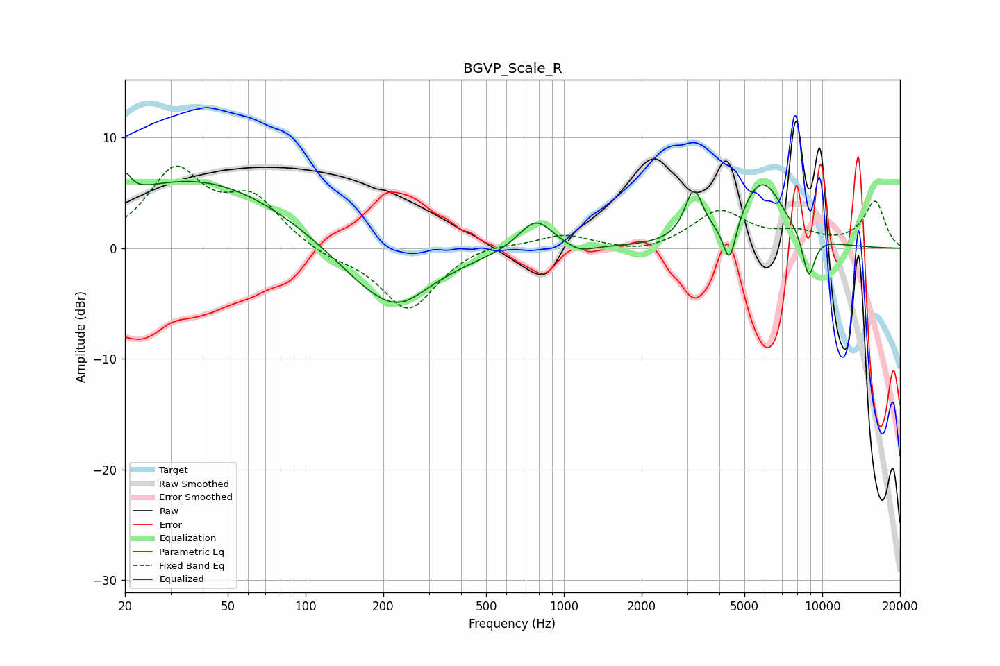

# BGVP_Scale_R
See [usage instructions](https://github.com/jaakkopasanen/AutoEq#usage) for more options and info.

### Parametric EQs
Apply preamp of -6.9 dB when using parametric equalizer.

|   # | Type    |   Fc (Hz) |    Q |   Gain (dB) |
|-----|---------|-----------|------|-------------|
|   1 | Peaking |        20 | 6    |         2   |
|   2 | Peaking |        38 | 0.38 |         6.3 |
|   3 | Peaking |       201 | 0.77 |        -5.2 |
|   4 | Peaking |       237 | 1.64 |        -1.1 |
|   5 | Peaking |       778 | 2.13 |         2.9 |
|   6 | Peaking |      1151 | 2.81 |        -0.6 |
|   7 | Peaking |      3185 | 4.12 |         4.4 |
|   8 | Peaking |      4380 | 5.4  |        -4.1 |
|   9 | Peaking |      5848 | 1.56 |         6.1 |
|  10 | Peaking |      8862 | 5.27 |        -4   |

### Fixed Band EQs
When using fixed band (also called graphic) equalizer, apply preamp of **-7.5 dB** (if available) and set gains manually with these parameters.

|   # | Type    |   Fc (Hz) |    Q |   Gain (dB) |
|-----|---------|-----------|------|-------------|
|   1 | Peaking |        31 | 1.41 |         6.7 |
|   2 | Peaking |        62 | 1.41 |         4.1 |
|   3 | Peaking |       125 | 1.41 |        -0.8 |
|   4 | Peaking |       250 | 1.41 |        -5.6 |
|   5 | Peaking |       500 | 1.41 |         0.6 |
|   6 | Peaking |      1000 | 1.41 |         1.2 |
|   7 | Peaking |      2000 | 1.41 |        -0.6 |
|   8 | Peaking |      4000 | 1.41 |         3.3 |
|   9 | Peaking |      8000 | 1.41 |         1.1 |
|  10 | Peaking |     16000 | 1.41 |         4.2 |

### Graphs

