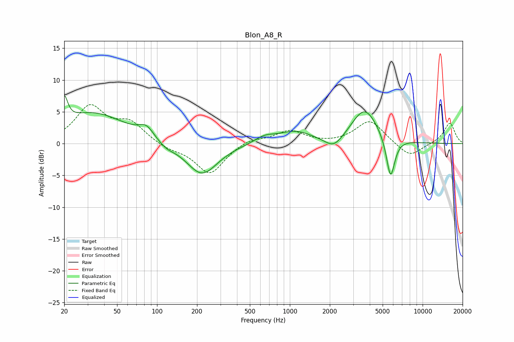

# Blon_A8_R
See [usage instructions](https://github.com/jaakkopasanen/AutoEq#usage) for more options and info.

### Parametric EQs
Apply preamp of -7.6 dB when using parametric equalizer.

|   # | Type    |   Fc (Hz) |    Q |   Gain (dB) |
|-----|---------|-----------|------|-------------|
|   1 | Peaking |        20 | 5.59 |         4   |
|   2 | Peaking |        33 | 0.56 |         4.8 |
|   3 | Peaking |        83 | 2.64 |         1.7 |
|   4 | Peaking |       117 | 2.47 |        -0.8 |
|   5 | Peaking |       218 | 1.19 |        -5   |
|   6 | Peaking |       646 | 1.84 |         1   |
|   7 | Peaking |      1097 | 1.11 |         1.8 |
|   8 | Peaking |      2150 | 2.02 |        -2   |
|   9 | Peaking |      3661 | 1.4  |         5.5 |
|  10 | Peaking |      5734 | 4.29 |        -6.7 |

### Fixed Band EQs
When using fixed band (also called graphic) equalizer, apply preamp of **-6.2 dB** (if available) and set gains manually with these parameters.

|   # | Type    |   Fc (Hz) |    Q |   Gain (dB) |
|-----|---------|-----------|------|-------------|
|   1 | Peaking |        31 | 1.41 |         5.6 |
|   2 | Peaking |        62 | 1.41 |         3   |
|   3 | Peaking |       125 | 1.41 |        -0.8 |
|   4 | Peaking |       250 | 1.41 |        -4.8 |
|   5 | Peaking |       500 | 1.41 |         0.8 |
|   6 | Peaking |      1000 | 1.41 |         2   |
|   7 | Peaking |      2000 | 1.41 |        -0.1 |
|   8 | Peaking |      4000 | 1.41 |         3.7 |
|   9 | Peaking |      8000 | 1.41 |        -2.2 |
|  10 | Peaking |     16000 | 1.41 |         3.3 |

### Graphs

