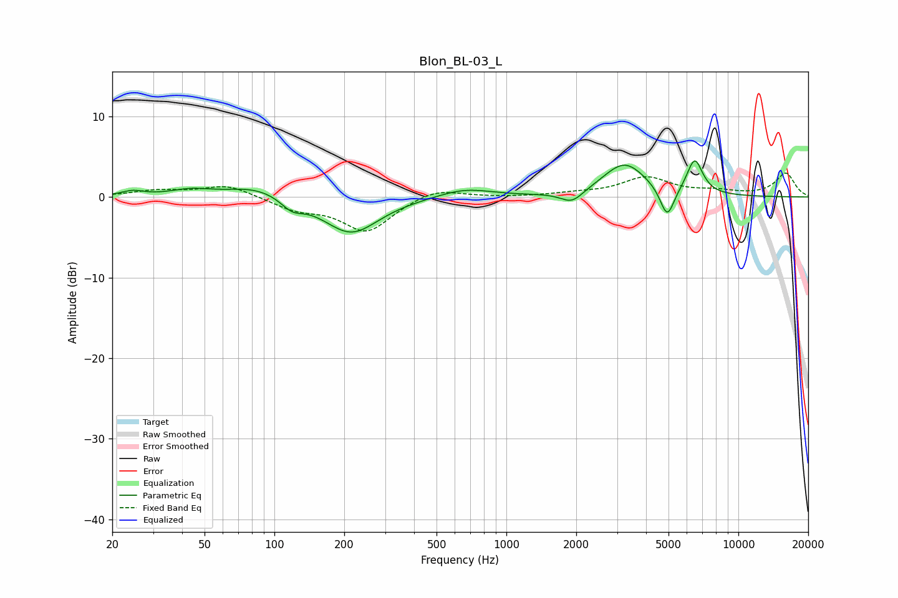

# Blon_BL-03_L
See [usage instructions](https://github.com/jaakkopasanen/AutoEq#usage) for more options and info.

### Parametric EQs
Apply preamp of -4.6 dB when using parametric equalizer.

|   # | Type    |   Fc (Hz) |    Q |   Gain (dB) |
|-----|---------|-----------|------|-------------|
|   1 | Peaking |        24 | 3.09 |         0.6 |
|   2 | Peaking |        43 | 1.7  |         0.7 |
|   3 | Peaking |        85 | 1.02 |         1.5 |
|   4 | Peaking |       119 | 2.89 |        -1.4 |
|   5 | Peaking |       214 | 1.18 |        -4.6 |
|   6 | Peaking |       662 | 1.22 |         1.1 |
|   7 | Peaking |      1918 | 2.92 |        -1.5 |
|   8 | Peaking |      3232 | 1.51 |         4.2 |
|   9 | Peaking |      4936 | 4.58 |        -3.9 |
|  10 | Peaking |      6485 | 3.98 |         4.3 |

### Fixed Band EQs
When using fixed band (also called graphic) equalizer, apply preamp of **-3.1 dB** (if available) and set gains manually with these parameters.

|   # | Type    |   Fc (Hz) |    Q |   Gain (dB) |
|-----|---------|-----------|------|-------------|
|   1 | Peaking |        31 | 1.41 |         0.7 |
|   2 | Peaking |        62 | 1.41 |         1.5 |
|   3 | Peaking |       125 | 1.41 |        -1.4 |
|   4 | Peaking |       250 | 1.41 |        -4.2 |
|   5 | Peaking |       500 | 1.41 |         1.2 |
|   6 | Peaking |      1000 | 1.41 |        -0   |
|   7 | Peaking |      2000 | 1.41 |         0.3 |
|   8 | Peaking |      4000 | 1.41 |         2.3 |
|   9 | Peaking |      8000 | 1.41 |         0.6 |
|  10 | Peaking |     16000 | 1.41 |         2.9 |

### Graphs

