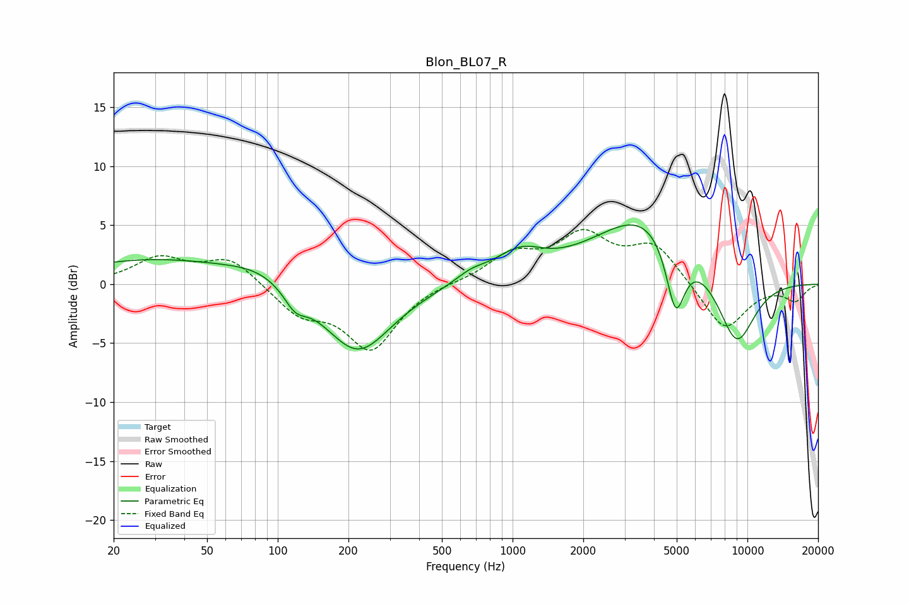

# Blon_BL07_R
See [usage instructions](https://github.com/jaakkopasanen/AutoEq#usage) for more options and info.

### Parametric EQs
Apply preamp of -5.1 dB when using parametric equalizer.

|   # | Type    |   Fc (Hz) |    Q |   Gain (dB) |
|-----|---------|-----------|------|-------------|
|   1 | Peaking |        30 | 0.4  |         2.1 |
|   2 | Peaking |        85 | 1.01 |         1.1 |
|   3 | Peaking |       119 | 2.96 |        -1.5 |
|   4 | Peaking |       219 | 0.98 |        -5.9 |
|   5 | Peaking |       665 | 2.06 |         0.7 |
|   6 | Peaking |      1096 | 1.25 |         2.5 |
|   7 | Peaking |      1311 | 1.35 |        -0.5 |
|   8 | Peaking |      3724 | 0.64 |         6   |
|   9 | Peaking |      4943 | 3.38 |        -6.2 |
|  10 | Peaking |      8964 | 1.53 |        -6.2 |

### Fixed Band EQs
When using fixed band (also called graphic) equalizer, apply preamp of **-4.7 dB** (if available) and set gains manually with these parameters.

|   # | Type    |   Fc (Hz) |    Q |   Gain (dB) |
|-----|---------|-----------|------|-------------|
|   1 | Peaking |        31 | 1.41 |         2.1 |
|   2 | Peaking |        62 | 1.41 |         2.2 |
|   3 | Peaking |       125 | 1.41 |        -2.3 |
|   4 | Peaking |       250 | 1.41 |        -5.4 |
|   5 | Peaking |       500 | 1.41 |         0.1 |
|   6 | Peaking |      1000 | 1.41 |         2.3 |
|   7 | Peaking |      2000 | 1.41 |         3.8 |
|   8 | Peaking |      4000 | 1.41 |         3.2 |
|   9 | Peaking |      8000 | 1.41 |        -4   |
|  10 | Peaking |     16000 | 1.41 |        -1.3 |

### Graphs

