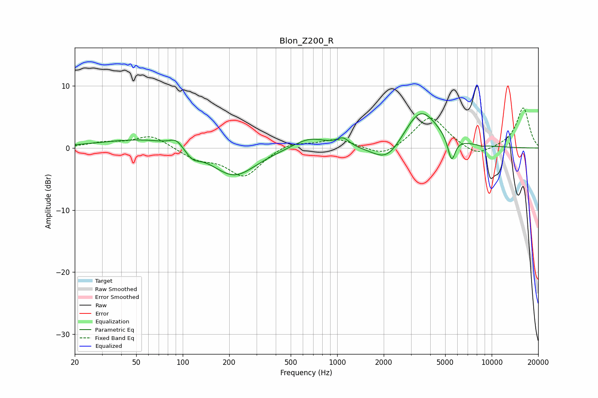

# Blon_Z200_R
See [usage instructions](https://github.com/jaakkopasanen/AutoEq#usage) for more options and info.

### Parametric EQs
Apply preamp of -5.6 dB when using parametric equalizer.

|   # | Type    |   Fc (Hz) |    Q |   Gain (dB) |
|-----|---------|-----------|------|-------------|
|   1 | Peaking |        58 | 0.52 |         1.6 |
|   2 | Peaking |        91 | 3.25 |         1.3 |
|   3 | Peaking |       116 | 2.93 |        -1.4 |
|   4 | Peaking |       214 | 0.98 |        -4.8 |
|   5 | Peaking |       662 | 1.28 |         1.8 |
|   6 | Peaking |      1092 | 3.49 |         1.3 |
|   7 | Peaking |      2117 | 1.44 |        -3.4 |
|   8 | Peaking |      3457 | 1.26 |         6.6 |
|   9 | Peaking |      5500 | 5.77 |        -3.9 |
|  10 | Peaking |      8635 | 5.5  |        -0.2 |

### Fixed Band EQs
When using fixed band (also called graphic) equalizer, apply preamp of **-6.5 dB** (if available) and set gains manually with these parameters.

|   # | Type    |   Fc (Hz) |    Q |   Gain (dB) |
|-----|---------|-----------|------|-------------|
|   1 | Peaking |        31 | 1.41 |         0.8 |
|   2 | Peaking |        62 | 1.41 |         2.1 |
|   3 | Peaking |       125 | 1.41 |        -1.7 |
|   4 | Peaking |       250 | 1.41 |        -4.5 |
|   5 | Peaking |       500 | 1.41 |         1.1 |
|   6 | Peaking |      1000 | 1.41 |         1.4 |
|   7 | Peaking |      2000 | 1.41 |        -1.6 |
|   8 | Peaking |      4000 | 1.41 |         5.2 |
|   9 | Peaking |      8000 | 1.41 |        -1.6 |
|  10 | Peaking |     16000 | 1.41 |         6.5 |

### Graphs

