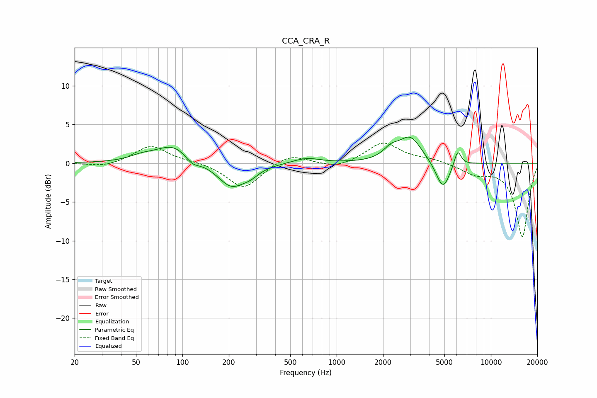

# CCA_CRA_R
See [usage instructions](https://github.com/jaakkopasanen/AutoEq#usage) for more options and info.

### Parametric EQs
Apply preamp of -3.5 dB when using parametric equalizer.

|   # | Type    |   Fc (Hz) |    Q |   Gain (dB) |
|-----|---------|-----------|------|-------------|
|   1 | Peaking |        54 | 1.87 |         0.6 |
|   2 | Peaking |        88 | 1.23 |         2.4 |
|   3 | Peaking |       116 | 3.01 |        -1   |
|   4 | Peaking |       207 | 1.57 |        -3.1 |
|   5 | Peaking |       277 | 2.56 |        -0.8 |
|   6 | Peaking |       637 | 1.6  |         0.7 |
|   7 | Peaking |      2251 | 2.8  |         1.2 |
|   8 | Peaking |      3005 | 1.92 |         3.3 |
|   9 | Peaking |      4891 | 3.07 |        -3.6 |
|  10 | Peaking |      6088 | 5.99 |         2.1 |

### Fixed Band EQs
When using fixed band (also called graphic) equalizer, apply preamp of **-2.7 dB** (if available) and set gains manually with these parameters.

|   # | Type    |   Fc (Hz) |    Q |   Gain (dB) |
|-----|---------|-----------|------|-------------|
|   1 | Peaking |        31 | 1.41 |        -0.5 |
|   2 | Peaking |        62 | 1.41 |         2.3 |
|   3 | Peaking |       125 | 1.41 |         0.2 |
|   4 | Peaking |       250 | 1.41 |        -3.3 |
|   5 | Peaking |       500 | 1.41 |         1.3 |
|   6 | Peaking |      1000 | 1.41 |        -0.7 |
|   7 | Peaking |      2000 | 1.41 |         2.7 |
|   8 | Peaking |      4000 | 1.41 |         0.5 |
|   9 | Peaking |      8000 | 1.41 |        -1.3 |
|  10 | Peaking |     16000 | 1.41 |        -9.5 |

### Graphs

