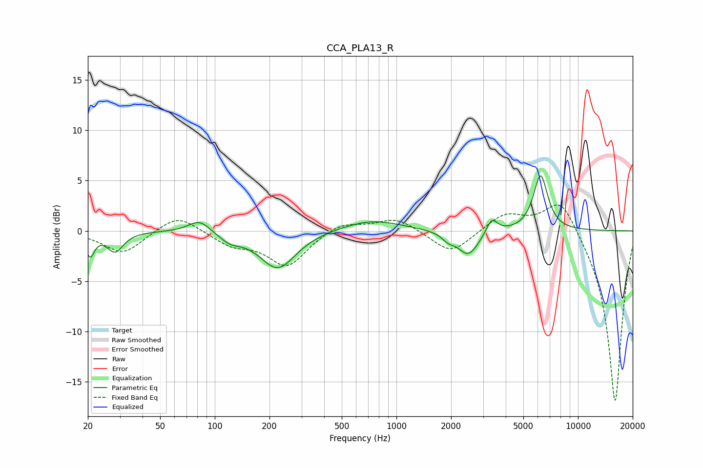

# CCA_PLA13_R
See [usage instructions](https://github.com/jaakkopasanen/AutoEq#usage) for more options and info.

### Parametric EQs
Apply preamp of -5.6 dB when using parametric equalizer.

|   # | Type    |   Fc (Hz) |    Q |   Gain (dB) |
|-----|---------|-----------|------|-------------|
|   1 | Peaking |        21 | 5.98 |        -2.3 |
|   2 | Peaking |        28 | 3.2  |        -2   |
|   3 | Peaking |        82 | 2.31 |         1.3 |
|   4 | Peaking |       121 | 2.46 |        -0.8 |
|   5 | Peaking |       222 | 1.43 |        -3.8 |
|   6 | Peaking |       727 | 0.87 |         1.1 |
|   7 | Peaking |      1929 | 4.29 |        -0.6 |
|   8 | Peaking |      2492 | 2.4  |        -2.5 |
|   9 | Peaking |      3353 | 4.6  |         1.5 |
|  10 | Peaking |      6219 | 3.5  |         5.5 |

### Fixed Band EQs
When using fixed band (also called graphic) equalizer, apply preamp of **-2.7 dB** (if available) and set gains manually with these parameters.

|   # | Type    |   Fc (Hz) |    Q |   Gain (dB) |
|-----|---------|-----------|------|-------------|
|   1 | Peaking |        31 | 1.41 |        -2.3 |
|   2 | Peaking |        62 | 1.41 |         1.8 |
|   3 | Peaking |       125 | 1.41 |        -1.3 |
|   4 | Peaking |       250 | 1.41 |        -3.4 |
|   5 | Peaking |       500 | 1.41 |         0.9 |
|   6 | Peaking |      1000 | 1.41 |         1.3 |
|   7 | Peaking |      2000 | 1.41 |        -2.3 |
|   8 | Peaking |      4000 | 1.41 |         1.8 |
|   9 | Peaking |      8000 | 1.41 |         3.7 |
|  10 | Peaking |     16000 | 1.41 |       -17.2 |

### Graphs

