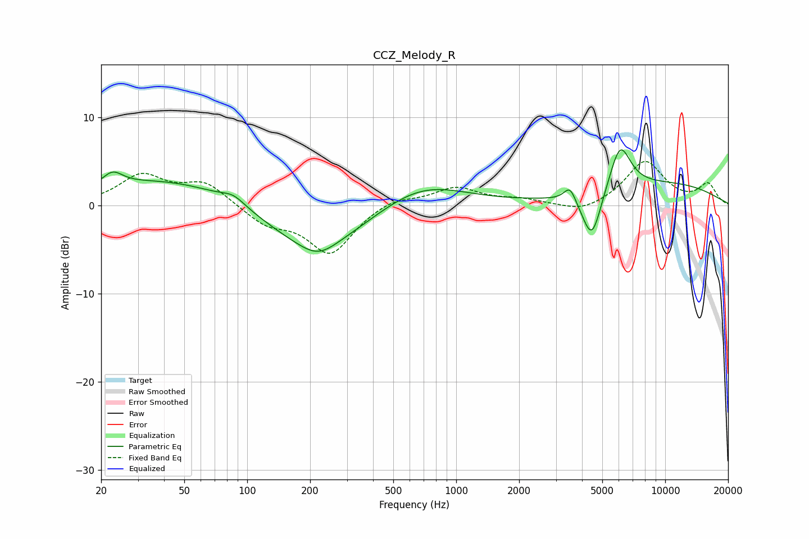

# CCZ_Melody_R
See [usage instructions](https://github.com/jaakkopasanen/AutoEq#usage) for more options and info.

### Parametric EQs
Apply preamp of -6.4 dB when using parametric equalizer.

|   # | Type    |   Fc (Hz) |    Q |   Gain (dB) |
|-----|---------|-----------|------|-------------|
|   1 | Peaking |        23 | 3.01 |         1.5 |
|   2 | Peaking |        44 | 0.37 |         3.1 |
|   3 | Peaking |        86 | 2.55 |         1   |
|   4 | Peaking |       209 | 0.56 |        -5.3 |
|   5 | Peaking |       219 | 1.71 |        -1.4 |
|   6 | Peaking |       680 | 0.68 |         2.9 |
|   7 | Peaking |      3502 | 5.02 |         1.8 |
|   8 | Peaking |      4456 | 3.03 |        -5.7 |
|   9 | Peaking |      6079 | 2.69 |         5.3 |
|  10 | Peaking |     10000 | 0.39 |         2.4 |

### Fixed Band EQs
When using fixed band (also called graphic) equalizer, apply preamp of **-5.1 dB** (if available) and set gains manually with these parameters.

|   # | Type    |   Fc (Hz) |    Q |   Gain (dB) |
|-----|---------|-----------|------|-------------|
|   1 | Peaking |        31 | 1.41 |         3.3 |
|   2 | Peaking |        62 | 1.41 |         2.5 |
|   3 | Peaking |       125 | 1.41 |        -2   |
|   4 | Peaking |       250 | 1.41 |        -5.4 |
|   5 | Peaking |       500 | 1.41 |         1   |
|   6 | Peaking |      1000 | 1.41 |         2   |
|   7 | Peaking |      2000 | 1.41 |         0.6 |
|   8 | Peaking |      4000 | 1.41 |        -1   |
|   9 | Peaking |      8000 | 1.41 |         5   |
|  10 | Peaking |     16000 | 1.41 |         2.3 |

### Graphs

