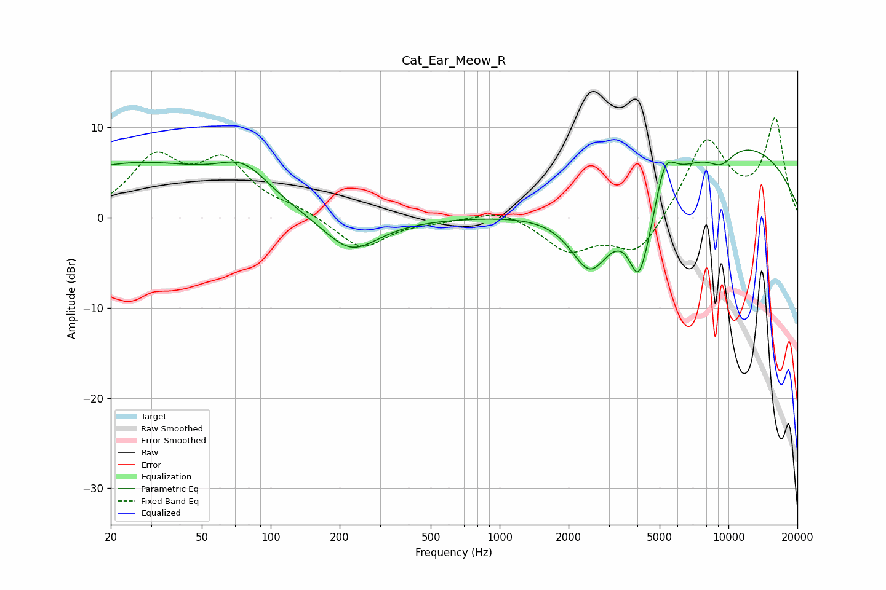

# Cat_Ear_Meow_R
See [usage instructions](https://github.com/jaakkopasanen/AutoEq#usage) for more options and info.

### Parametric EQs
Apply preamp of -7.6 dB when using parametric equalizer.

|   # | Type    |   Fc (Hz) |    Q |   Gain (dB) |
|-----|---------|-----------|------|-------------|
|   1 | Peaking |        25 | 0.34 |         5.9 |
|   2 | Peaking |        76 | 1.28 |         3.2 |
|   3 | Peaking |       223 | 1.03 |        -3.1 |
|   4 | Peaking |       225 | 1.57 |        -1   |
|   5 | Peaking |      2488 | 1.57 |        -7.3 |
|   6 | Peaking |      4039 | 3.62 |        -5.4 |
|   7 | Peaking |      4628 | 1.45 |        -7.9 |
|   8 | Peaking |      5219 | 2.56 |         7.5 |
|   9 | Peaking |      9281 | 2.22 |        -1.9 |
|  10 | Peaking |      9723 | 0.29 |         8.7 |

### Fixed Band EQs
When using fixed band (also called graphic) equalizer, apply preamp of **-11.1 dB** (if available) and set gains manually with these parameters.

|   # | Type    |   Fc (Hz) |    Q |   Gain (dB) |
|-----|---------|-----------|------|-------------|
|   1 | Peaking |        31 | 1.41 |         6.1 |
|   2 | Peaking |        62 | 1.41 |         5.7 |
|   3 | Peaking |       125 | 1.41 |         0.8 |
|   4 | Peaking |       250 | 1.41 |        -3.5 |
|   5 | Peaking |       500 | 1.41 |        -0.3 |
|   6 | Peaking |      1000 | 1.41 |         1.1 |
|   7 | Peaking |      2000 | 1.41 |        -3.5 |
|   8 | Peaking |      4000 | 1.41 |        -4.3 |
|   9 | Peaking |      8000 | 1.41 |         8.7 |
|  10 | Peaking |     16000 | 1.41 |        10.7 |

### Graphs

