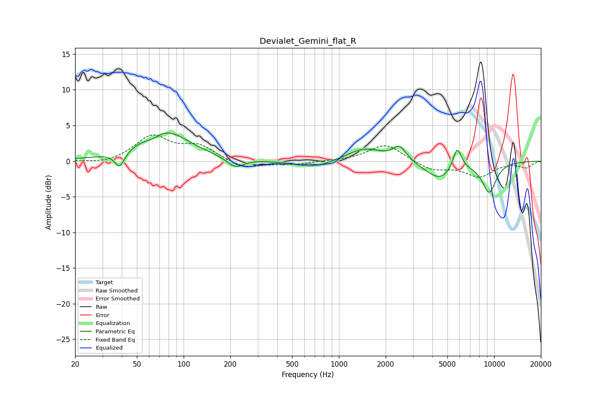

# Devialet_Gemini_flat_R
See [usage instructions](https://github.com/jaakkopasanen/AutoEq#usage) for more options and info.

### Parametric EQs
Apply preamp of -4.0 dB when using parametric equalizer.

|   # | Type    |   Fc (Hz) |    Q |   Gain (dB) |
|-----|---------|-----------|------|-------------|
|   1 | Peaking |        39 | 4.47 |        -2.3 |
|   2 | Peaking |        64 | 2.76 |        -0.7 |
|   3 | Peaking |        75 | 0.9  |         4.4 |
|   4 | Peaking |       215 | 2.65 |        -1.4 |
|   5 | Peaking |       699 | 1.13 |        -1.1 |
|   6 | Peaking |      1468 | 1.17 |         1.9 |
|   7 | Peaking |      2461 | 3.32 |         2   |
|   8 | Peaking |      4470 | 1.46 |        -2.6 |
|   9 | Peaking |      5779 | 4.83 |         3.3 |
|  10 | Peaking |      9288 | 2.72 |        -4.2 |

### Fixed Band EQs
When using fixed band (also called graphic) equalizer, apply preamp of **-3.8 dB** (if available) and set gains manually with these parameters.

|   # | Type    |   Fc (Hz) |    Q |   Gain (dB) |
|-----|---------|-----------|------|-------------|
|   1 | Peaking |        31 | 1.41 |        -0.5 |
|   2 | Peaking |        62 | 1.41 |         3.4 |
|   3 | Peaking |       125 | 1.41 |         2   |
|   4 | Peaking |       250 | 1.41 |        -1.1 |
|   5 | Peaking |       500 | 1.41 |        -0.4 |
|   6 | Peaking |      1000 | 1.41 |         0   |
|   7 | Peaking |      2000 | 1.41 |         2.4 |
|   8 | Peaking |      4000 | 1.41 |        -1.3 |
|   9 | Peaking |      8000 | 1.41 |        -2.1 |
|  10 | Peaking |     16000 | 1.41 |        -0.9 |

### Graphs

