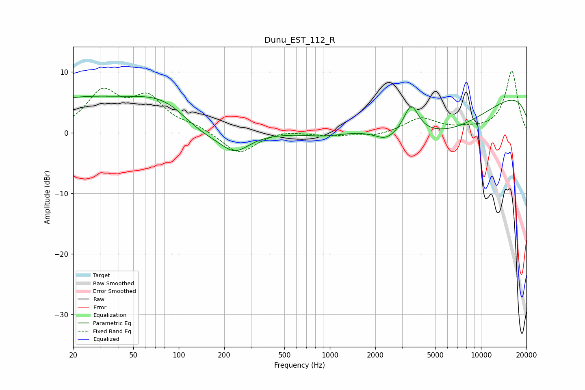

# Dunu_EST_112_R
See [usage instructions](https://github.com/jaakkopasanen/AutoEq#usage) for more options and info.

### Parametric EQs
Apply preamp of -6.1 dB when using parametric equalizer.

|   # | Type    |   Fc (Hz) |    Q |   Gain (dB) |
|-----|---------|-----------|------|-------------|
|   1 | Peaking |        20 | 0.4  |         5   |
|   2 | Peaking |        87 | 0.59 |         6.4 |
|   3 | Peaking |       133 | 0.74 |        -4.1 |
|   4 | Peaking |       235 | 1.48 |        -3.2 |
|   5 | Peaking |       929 | 1.12 |        -0.7 |
|   6 | Peaking |      2350 | 1.97 |        -1.7 |
|   7 | Peaking |      3116 | 6    |         0.1 |
|   8 | Peaking |      3462 | 3.05 |         4.6 |
|   9 | Peaking |      5745 | 0.39 |        -7.1 |
|  10 | Peaking |     10000 | 0.18 |         8.1 |

### Fixed Band EQs
When using fixed band (also called graphic) equalizer, apply preamp of **-10.2 dB** (if available) and set gains manually with these parameters.

|   # | Type    |   Fc (Hz) |    Q |   Gain (dB) |
|-----|---------|-----------|------|-------------|
|   1 | Peaking |        31 | 1.41 |         6.3 |
|   2 | Peaking |        62 | 1.41 |         5.3 |
|   3 | Peaking |       125 | 1.41 |         0.9 |
|   4 | Peaking |       250 | 1.41 |        -3.6 |
|   5 | Peaking |       500 | 1.41 |         0.4 |
|   6 | Peaking |      1000 | 1.41 |        -0.5 |
|   7 | Peaking |      2000 | 1.41 |        -0.6 |
|   8 | Peaking |      4000 | 1.41 |         2.4 |
|   9 | Peaking |      8000 | 1.41 |         0.4 |
|  10 | Peaking |     16000 | 1.41 |        10.2 |

### Graphs

