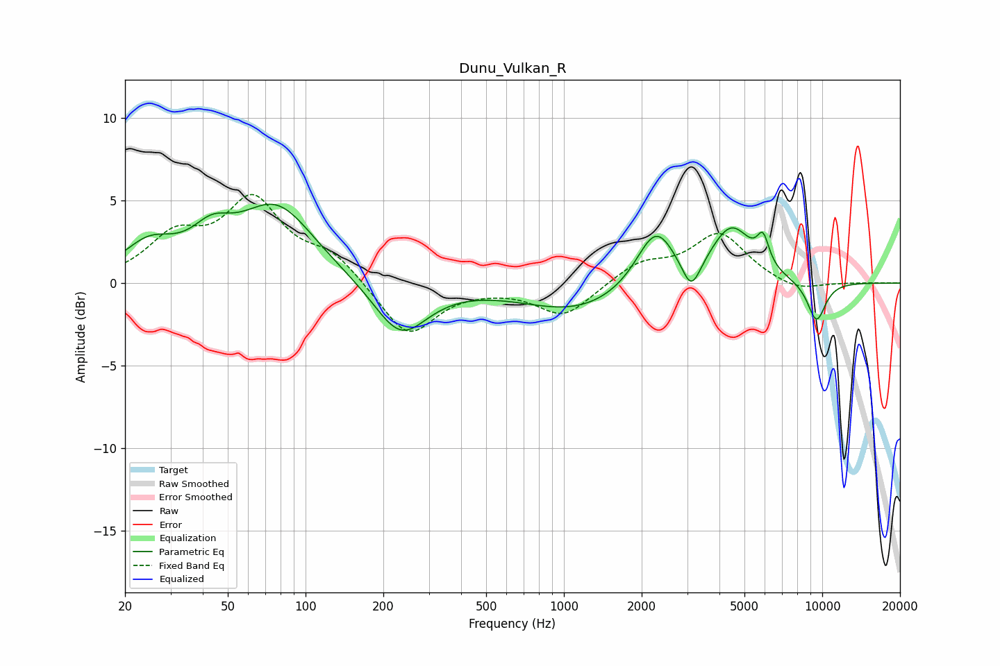

# Dunu_Vulkan_R
See [usage instructions](https://github.com/jaakkopasanen/AutoEq#usage) for more options and info.

### Parametric EQs
Apply preamp of -4.9 dB when using parametric equalizer.

|   # | Type    |   Fc (Hz) |    Q |   Gain (dB) |
|-----|---------|-----------|------|-------------|
|   1 | Peaking |        25 | 1.4  |         2   |
|   2 | Peaking |        43 | 1.82 |         1.8 |
|   3 | Peaking |        77 | 0.96 |         4.6 |
|   4 | Peaking |       233 | 1.37 |        -3.3 |
|   5 | Peaking |      1131 | 0.66 |        -1.7 |
|   6 | Peaking |      2265 | 1.9  |         3.5 |
|   7 | Peaking |      3113 | 3.89 |        -2   |
|   8 | Peaking |      4452 | 1.74 |         3.3 |
|   9 | Peaking |      5903 | 6    |         1.7 |
|  10 | Peaking |      9501 | 3.42 |        -2.5 |

### Fixed Band EQs
When using fixed band (also called graphic) equalizer, apply preamp of **-5.5 dB** (if available) and set gains manually with these parameters.

|   # | Type    |   Fc (Hz) |    Q |   Gain (dB) |
|-----|---------|-----------|------|-------------|
|   1 | Peaking |        31 | 1.41 |         2.5 |
|   2 | Peaking |        62 | 1.41 |         4.7 |
|   3 | Peaking |       125 | 1.41 |         1.6 |
|   4 | Peaking |       250 | 1.41 |        -3.3 |
|   5 | Peaking |       500 | 1.41 |        -0.1 |
|   6 | Peaking |      1000 | 1.41 |        -2   |
|   7 | Peaking |      2000 | 1.41 |         1.2 |
|   8 | Peaking |      4000 | 1.41 |         3   |
|   9 | Peaking |      8000 | 1.41 |        -0.6 |
|  10 | Peaking |     16000 | 1.41 |         0   |

### Graphs

