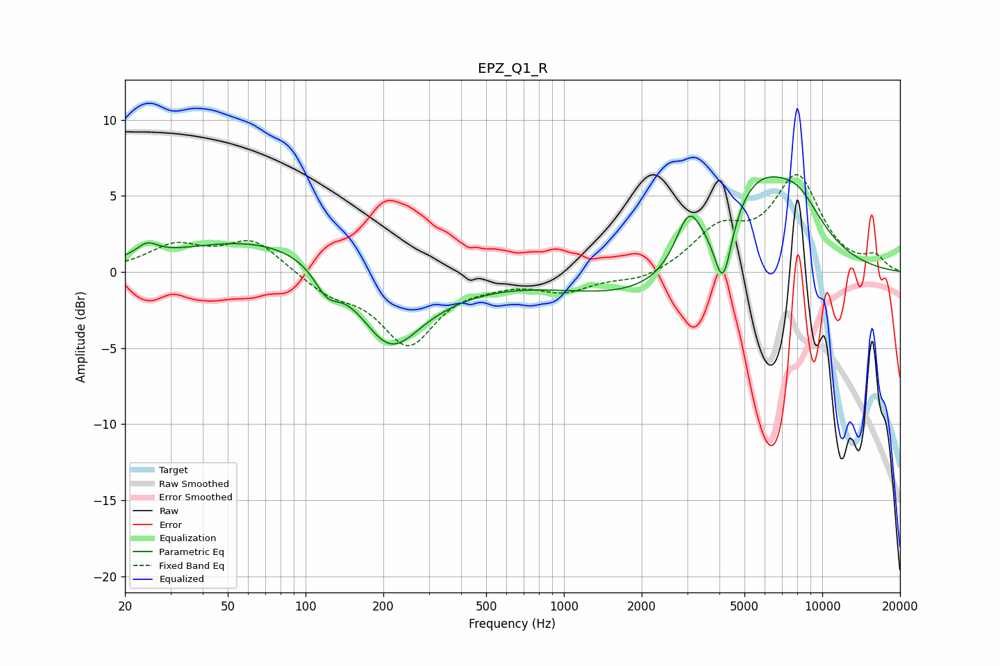

# EPZ_Q1_R
See [usage instructions](https://github.com/jaakkopasanen/AutoEq#usage) for more options and info.

### Parametric EQs
Apply preamp of -6.3 dB when using parametric equalizer.

|   # | Type    |   Fc (Hz) |    Q |   Gain (dB) |
|-----|---------|-----------|------|-------------|
|   1 | Peaking |        24 | 3.37 |         0.9 |
|   2 | Peaking |        71 | 0.4  |         2.3 |
|   3 | Peaking |       121 | 2.84 |        -1.6 |
|   4 | Peaking |       211 | 1.18 |        -4.9 |
|   5 | Peaking |       323 | 0.7  |        -0.9 |
|   6 | Peaking |      2407 | 0.44 |        -2.3 |
|   7 | Peaking |      3044 | 2.77 |         3.4 |
|   8 | Peaking |      4130 | 4.16 |        -4.4 |
|   9 | Peaking |      5551 | 0.84 |         6.6 |
|  10 | Peaking |      8132 | 1.42 |         2.2 |

### Fixed Band EQs
When using fixed band (also called graphic) equalizer, apply preamp of **-6.5 dB** (if available) and set gains manually with these parameters.

|   # | Type    |   Fc (Hz) |    Q |   Gain (dB) |
|-----|---------|-----------|------|-------------|
|   1 | Peaking |        31 | 1.41 |         1.6 |
|   2 | Peaking |        62 | 1.41 |         2.1 |
|   3 | Peaking |       125 | 1.41 |        -1.2 |
|   4 | Peaking |       250 | 1.41 |        -4.6 |
|   5 | Peaking |       500 | 1.41 |        -0.4 |
|   6 | Peaking |      1000 | 1.41 |        -1.2 |
|   7 | Peaking |      2000 | 1.41 |        -0.6 |
|   8 | Peaking |      4000 | 1.41 |         2.5 |
|   9 | Peaking |      8000 | 1.41 |         6   |
|  10 | Peaking |     16000 | 1.41 |         0.9 |

### Graphs

