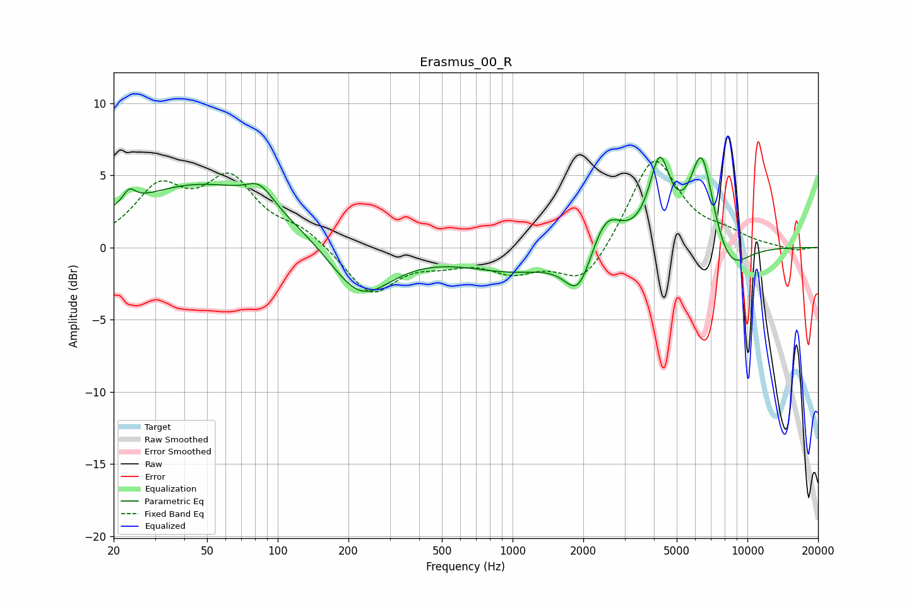

# Erasmus_00_R
See [usage instructions](https://github.com/jaakkopasanen/AutoEq#usage) for more options and info.

### Parametric EQs
Apply preamp of -6.4 dB when using parametric equalizer.

|   # | Type    |   Fc (Hz) |    Q |   Gain (dB) |
|-----|---------|-----------|------|-------------|
|   1 | Peaking |        23 | 5.4  |         0.9 |
|   2 | Peaking |        48 | 0.4  |         4.4 |
|   3 | Peaking |        84 | 2.52 |         1.3 |
|   4 | Peaking |       225 | 1.07 |        -3.9 |
|   5 | Peaking |      1018 | 0.66 |        -1.5 |
|   6 | Peaking |      1909 | 2.42 |        -3   |
|   7 | Peaking |      2490 | 2.15 |         2.8 |
|   8 | Peaking |      4231 | 3.17 |         5.5 |
|   9 | Peaking |      6395 | 2.7  |         6.7 |
|  10 | Peaking |      8370 | 1.65 |        -2.3 |

### Fixed Band EQs
When using fixed band (also called graphic) equalizer, apply preamp of **-6.1 dB** (if available) and set gains manually with these parameters.

|   # | Type    |   Fc (Hz) |    Q |   Gain (dB) |
|-----|---------|-----------|------|-------------|
|   1 | Peaking |        31 | 1.41 |         3.8 |
|   2 | Peaking |        62 | 1.41 |         4.4 |
|   3 | Peaking |       125 | 1.41 |         1.1 |
|   4 | Peaking |       250 | 1.41 |        -3.3 |
|   5 | Peaking |       500 | 1.41 |        -0.8 |
|   6 | Peaking |      1000 | 1.41 |        -1.5 |
|   7 | Peaking |      2000 | 1.41 |        -2.7 |
|   8 | Peaking |      4000 | 1.41 |         6.4 |
|   9 | Peaking |      8000 | 1.41 |         0.7 |
|  10 | Peaking |     16000 | 1.41 |        -0.3 |

### Graphs

