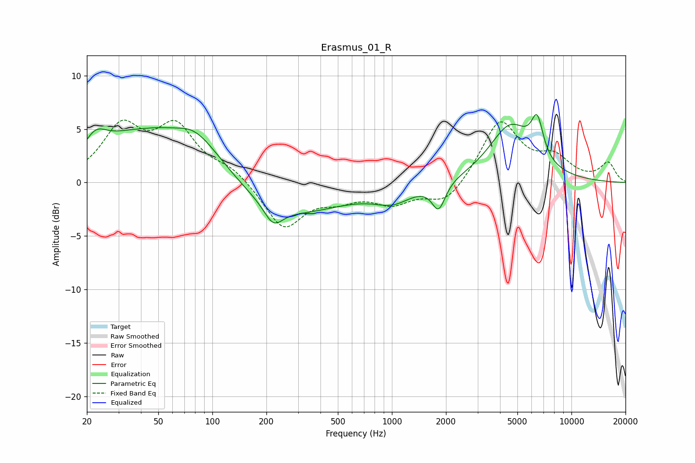

# Erasmus_01_R
See [usage instructions](https://github.com/jaakkopasanen/AutoEq#usage) for more options and info.

### Parametric EQs
Apply preamp of -6.5 dB when using parametric equalizer.

|   # | Type    |   Fc (Hz) |    Q |   Gain (dB) |
|-----|---------|-----------|------|-------------|
|   1 | Peaking |        22 | 2.19 |         2.1 |
|   2 | Peaking |        32 | 0.79 |         2.6 |
|   3 | Peaking |        64 | 1.59 |        -1.1 |
|   4 | Peaking |        72 | 0.79 |         6   |
|   5 | Peaking |       219 | 2.75 |        -1.8 |
|   6 | Peaking |       261 | 0.47 |        -3.1 |
|   7 | Peaking |      1013 | 1.35 |        -1.4 |
|   8 | Peaking |      1821 | 3.86 |        -2.5 |
|   9 | Peaking |      4573 | 1.18 |         5.2 |
|  10 | Peaking |      6445 | 4.06 |         3.6 |

### Fixed Band EQs
When using fixed band (also called graphic) equalizer, apply preamp of **-5.9 dB** (if available) and set gains manually with these parameters.

|   # | Type    |   Fc (Hz) |    Q |   Gain (dB) |
|-----|---------|-----------|------|-------------|
|   1 | Peaking |        31 | 1.41 |         4.9 |
|   2 | Peaking |        62 | 1.41 |         4.8 |
|   3 | Peaking |       125 | 1.41 |         1.2 |
|   4 | Peaking |       250 | 1.41 |        -4.3 |
|   5 | Peaking |       500 | 1.41 |        -1.2 |
|   6 | Peaking |      1000 | 1.41 |        -1.7 |
|   7 | Peaking |      2000 | 1.41 |        -2   |
|   8 | Peaking |      4000 | 1.41 |         5.8 |
|   9 | Peaking |      8000 | 1.41 |         2   |
|  10 | Peaking |     16000 | 1.41 |         1.8 |

### Graphs

