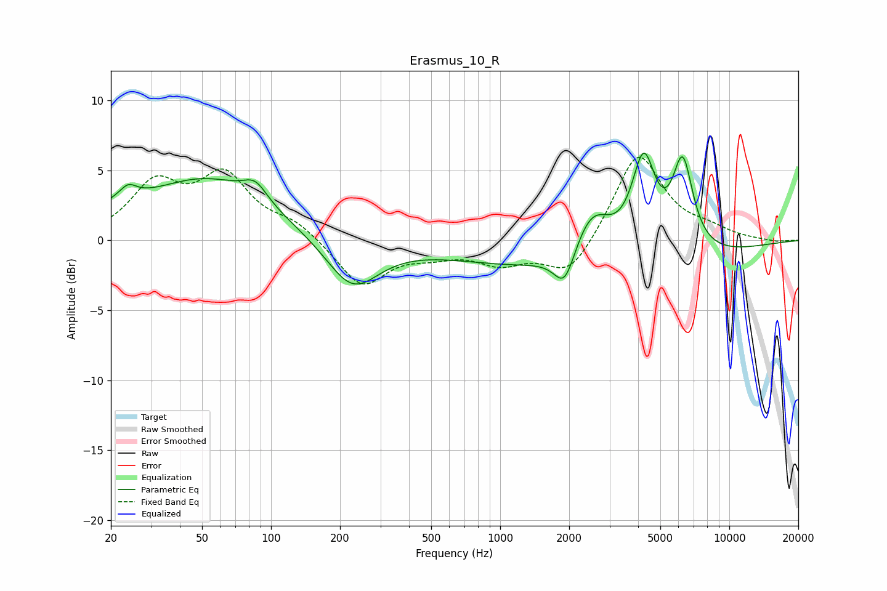

# Erasmus_10_R
See [usage instructions](https://github.com/jaakkopasanen/AutoEq#usage) for more options and info.

### Parametric EQs
Apply preamp of -6.3 dB when using parametric equalizer.

|   # | Type    |   Fc (Hz) |    Q |   Gain (dB) |
|-----|---------|-----------|------|-------------|
|   1 | Peaking |        21 | 1.36 |         1.1 |
|   2 | Peaking |        24 | 4.37 |         0.7 |
|   3 | Peaking |        52 | 0.53 |         4.3 |
|   4 | Peaking |        85 | 2.74 |         1.3 |
|   5 | Peaking |       226 | 1.22 |        -3.6 |
|   6 | Peaking |      1911 | 3.09 |        -2.6 |
|   7 | Peaking |      2513 | 1.64 |         3.7 |
|   8 | Peaking |      2559 | 0.24 |        -2.3 |
|   9 | Peaking |      4228 | 2.63 |         6.8 |
|  10 | Peaking |      6260 | 2.99 |         6.5 |

### Fixed Band EQs
When using fixed band (also called graphic) equalizer, apply preamp of **-6.0 dB** (if available) and set gains manually with these parameters.

|   # | Type    |   Fc (Hz) |    Q |   Gain (dB) |
|-----|---------|-----------|------|-------------|
|   1 | Peaking |        31 | 1.41 |         3.8 |
|   2 | Peaking |        62 | 1.41 |         4.3 |
|   3 | Peaking |       125 | 1.41 |         1.1 |
|   4 | Peaking |       250 | 1.41 |        -3.3 |
|   5 | Peaking |       500 | 1.41 |        -0.8 |
|   6 | Peaking |      1000 | 1.41 |        -1.5 |
|   7 | Peaking |      2000 | 1.41 |        -2.6 |
|   8 | Peaking |      4000 | 1.41 |         6.4 |
|   9 | Peaking |      8000 | 1.41 |         0.6 |
|  10 | Peaking |     16000 | 1.41 |        -0.1 |

### Graphs

