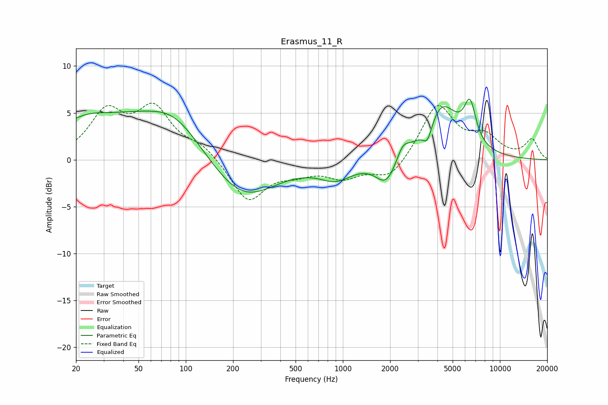

# Erasmus_11_R
See [usage instructions](https://github.com/jaakkopasanen/AutoEq#usage) for more options and info.

### Parametric EQs
Apply preamp of -6.6 dB when using parametric equalizer.

|   # | Type    |   Fc (Hz) |    Q |   Gain (dB) |
|-----|---------|-----------|------|-------------|
|   1 | Peaking |        28 | 0.51 |         5   |
|   2 | Peaking |        33 | 1.2  |        -0.8 |
|   3 | Peaking |        84 | 0.77 |         4   |
|   4 | Peaking |       230 | 0.69 |        -4.5 |
|   5 | Peaking |       905 | 1.35 |        -1.8 |
|   6 | Peaking |      1894 | 2.08 |        -2.8 |
|   7 | Peaking |      2409 | 3.67 |         1.5 |
|   8 | Peaking |      3462 | 4.5  |        -2.1 |
|   9 | Peaking |      4237 | 1.28 |         5.8 |
|  10 | Peaking |      6449 | 3.62 |         4.2 |

### Fixed Band EQs
When using fixed band (also called graphic) equalizer, apply preamp of **-6.1 dB** (if available) and set gains manually with these parameters.

|   # | Type    |   Fc (Hz) |    Q |   Gain (dB) |
|-----|---------|-----------|------|-------------|
|   1 | Peaking |        31 | 1.41 |         4.8 |
|   2 | Peaking |        62 | 1.41 |         5   |
|   3 | Peaking |       125 | 1.41 |         1.4 |
|   4 | Peaking |       250 | 1.41 |        -4.4 |
|   5 | Peaking |       500 | 1.41 |        -1.1 |
|   6 | Peaking |      1000 | 1.41 |        -1.7 |
|   7 | Peaking |      2000 | 1.41 |        -2.1 |
|   8 | Peaking |      4000 | 1.41 |         5.9 |
|   9 | Peaking |      8000 | 1.41 |         2.2 |
|  10 | Peaking |     16000 | 1.41 |         2.1 |

### Graphs

