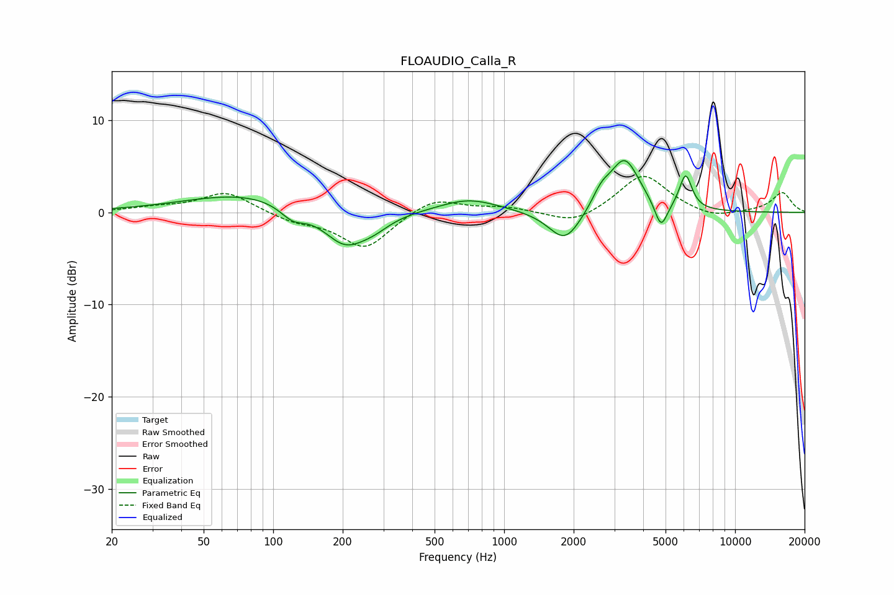

# FLOAUDIO_Calla_R
See [usage instructions](https://github.com/jaakkopasanen/AutoEq#usage) for more options and info.

### Parametric EQs
Apply preamp of -5.7 dB when using parametric equalizer.

|   # | Type    |   Fc (Hz) |    Q |   Gain (dB) |
|-----|---------|-----------|------|-------------|
|   1 | Peaking |        78 | 0.53 |         2.1 |
|   2 | Peaking |       121 | 2.56 |        -1.5 |
|   3 | Peaking |       204 | 1.48 |        -3.9 |
|   4 | Peaking |       273 | 1.95 |        -1   |
|   5 | Peaking |       703 | 1.09 |         1.5 |
|   6 | Peaking |      1835 | 2.01 |        -3.5 |
|   7 | Peaking |      2633 | 3.57 |         1.6 |
|   8 | Peaking |      3326 | 2.18 |         5.7 |
|   9 | Peaking |      4780 | 5.06 |        -3   |
|  10 | Peaking |      6107 | 5.08 |         3.8 |

### Fixed Band EQs
When using fixed band (also called graphic) equalizer, apply preamp of **-4.0 dB** (if available) and set gains manually with these parameters.

|   # | Type    |   Fc (Hz) |    Q |   Gain (dB) |
|-----|---------|-----------|------|-------------|
|   1 | Peaking |        31 | 1.41 |         0.5 |
|   2 | Peaking |        62 | 1.41 |         2.2 |
|   3 | Peaking |       125 | 1.41 |        -0.9 |
|   4 | Peaking |       250 | 1.41 |        -3.9 |
|   5 | Peaking |       500 | 1.41 |         1.7 |
|   6 | Peaking |      1000 | 1.41 |         0.5 |
|   7 | Peaking |      2000 | 1.41 |        -1.4 |
|   8 | Peaking |      4000 | 1.41 |         4.2 |
|   9 | Peaking |      8000 | 1.41 |        -0.7 |
|  10 | Peaking |     16000 | 1.41 |         2.1 |

### Graphs

