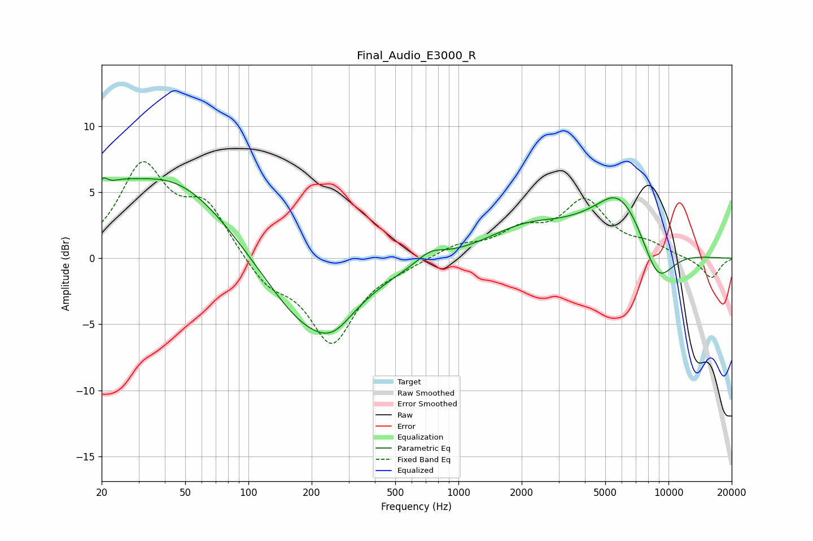

# Final_Audio_E3000_R
See [usage instructions](https://github.com/jaakkopasanen/AutoEq#usage) for more options and info.

### Parametric EQs
Apply preamp of -6.2 dB when using parametric equalizer.

|   # | Type    |   Fc (Hz) |    Q |   Gain (dB) |
|-----|---------|-----------|------|-------------|
|   1 | Peaking |        20 | 6    |         1.2 |
|   2 | Peaking |        23 | 1.46 |         1.6 |
|   3 | Peaking |        43 | 0.49 |         6.1 |
|   4 | Peaking |       194 | 0.66 |        -5.7 |
|   5 | Peaking |       254 | 1.63 |        -1.3 |
|   6 | Peaking |       735 | 2.16 |         0.8 |
|   7 | Peaking |      2114 | 0.72 |         2.1 |
|   8 | Peaking |      4729 | 1.73 |        -0.5 |
|   9 | Peaking |      5734 | 0.96 |         5.2 |
|  10 | Peaking |      8833 | 1.61 |        -3.6 |

### Fixed Band EQs
When using fixed band (also called graphic) equalizer, apply preamp of **-7.4 dB** (if available) and set gains manually with these parameters.

|   # | Type    |   Fc (Hz) |    Q |   Gain (dB) |
|-----|---------|-----------|------|-------------|
|   1 | Peaking |        31 | 1.41 |         6.7 |
|   2 | Peaking |        62 | 1.41 |         3.7 |
|   3 | Peaking |       125 | 1.41 |        -1.9 |
|   4 | Peaking |       250 | 1.41 |        -6.3 |
|   5 | Peaking |       500 | 1.41 |        -0.5 |
|   6 | Peaking |      1000 | 1.41 |         0.9 |
|   7 | Peaking |      2000 | 1.41 |         1.8 |
|   8 | Peaking |      4000 | 1.41 |         4.1 |
|   9 | Peaking |      8000 | 1.41 |         0.8 |
|  10 | Peaking |     16000 | 1.41 |        -1.5 |

### Graphs

