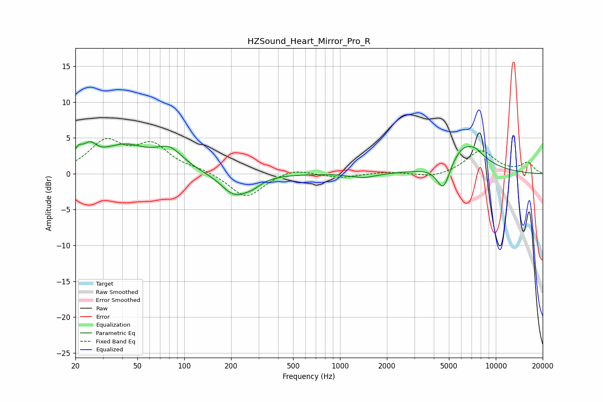

# HZSound_Heart_Mirror_Pro_R
See [usage instructions](https://github.com/jaakkopasanen/AutoEq#usage) for more options and info.

### Parametric EQs
Apply preamp of -4.6 dB when using parametric equalizer.

|   # | Type    |   Fc (Hz) |    Q |   Gain (dB) |
|-----|---------|-----------|------|-------------|
|   1 | Peaking |        21 | 4.67 |         1.7 |
|   2 | Peaking |        25 | 3.33 |         2   |
|   3 | Peaking |        41 | 0.91 |         3.6 |
|   4 | Peaking |        81 | 1.63 |         2.6 |
|   5 | Peaking |       209 | 1.68 |        -2.9 |
|   6 | Peaking |       272 | 2.4  |        -0.9 |
|   7 | Peaking |      1418 | 1.89 |        -0.6 |
|   8 | Peaking |      4611 | 3.23 |        -4.1 |
|   9 | Peaking |      6384 | 1.19 |         4.2 |
|  10 | Peaking |      7526 | 4.61 |         0.3 |

### Fixed Band EQs
When using fixed band (also called graphic) equalizer, apply preamp of **-5.0 dB** (if available) and set gains manually with these parameters.

|   # | Type    |   Fc (Hz) |    Q |   Gain (dB) |
|-----|---------|-----------|------|-------------|
|   1 | Peaking |        31 | 1.41 |         4.2 |
|   2 | Peaking |        62 | 1.41 |         3.7 |
|   3 | Peaking |       125 | 1.41 |         0.5 |
|   4 | Peaking |       250 | 1.41 |        -3.4 |
|   5 | Peaking |       500 | 1.41 |         0.8 |
|   6 | Peaking |      1000 | 1.41 |        -0.6 |
|   7 | Peaking |      2000 | 1.41 |         0.3 |
|   8 | Peaking |      4000 | 1.41 |        -0.6 |
|   9 | Peaking |      8000 | 1.41 |         3.2 |
|  10 | Peaking |     16000 | 1.41 |         1.5 |

### Graphs

